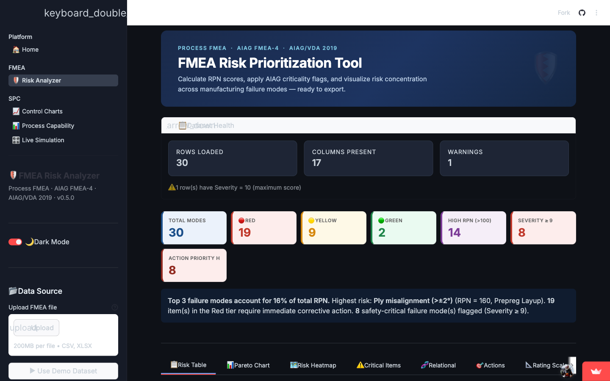
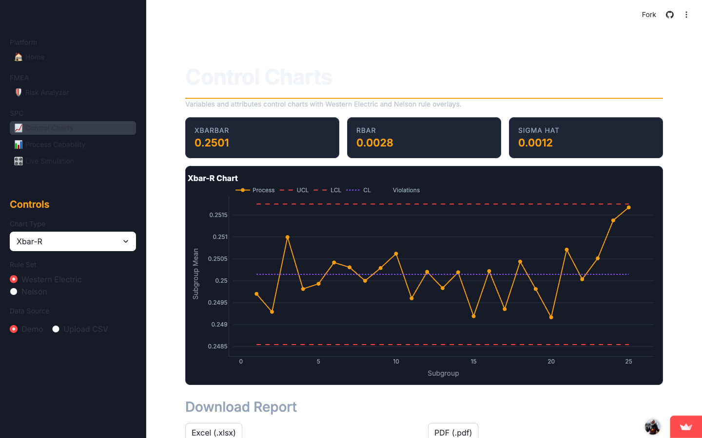
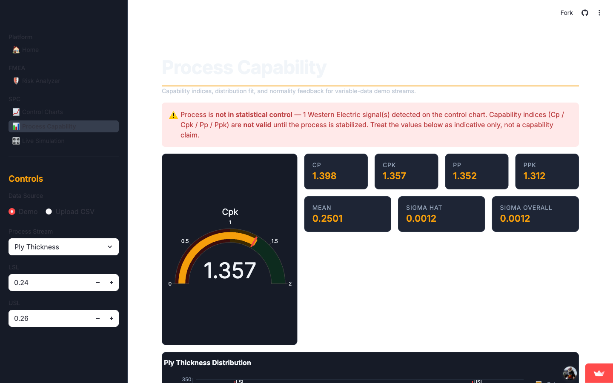
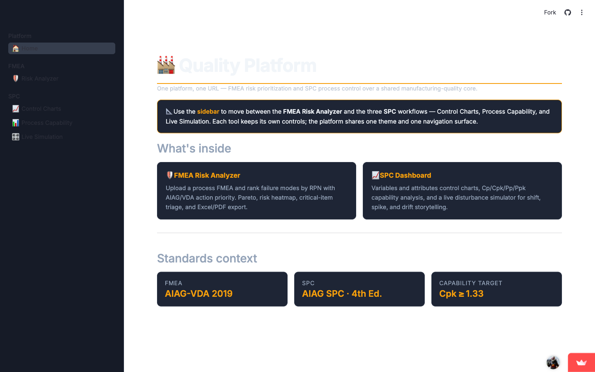
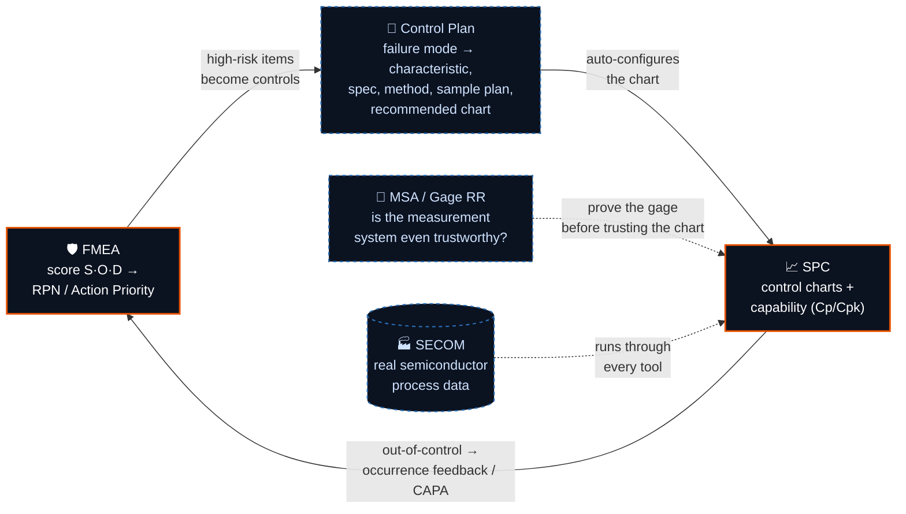
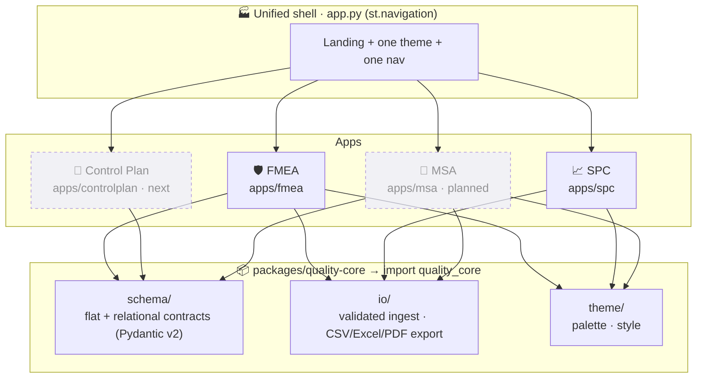

<!-- ░░░░░░░░░░░░░░░░░░░░░░░░░░░░░░░░  HEADER  ░░░░░░░░░░░░░░░░░░░░░░░░░░░░░░░░ -->

<a href="https://quality-platform-nplyhc6rvsd3bfw6q9vvkd.streamlit.app/">
  
</a>

<div align="center">


<br>

[](https://github.com/Siddardth7/quality-platform/actions/workflows/ci.yml)
[](#-the-quality-gate)
[](#-the-quality-gate)
[](https://github.com/Siddardth7/quality-platform/releases/latest)
[](https://github.com/Siddardth7/quality-platform/commits/main)

[](.python-version)
[](https://github.com/astral-sh/uv)
[](https://github.com/astral-sh/ruff)
[](https://mypy-lang.org/)
[](https://streamlit.io/)

<br>

**A working manufacturing-quality engineering platform — the AIAG core tools (FMEA, SPC, Control Plan, MSA)<br>brought under one URL, one typed core, and one CI-enforced quality bar.**

<br>

<a href="https://quality-platform-nplyhc6rvsd3bfw6q9vvkd.streamlit.app/"></a>
&nbsp;
<a href="ROADMAP.md"></a>
&nbsp;
<a href="CONTRIBUTING.md"></a>
&nbsp;
<a href="CHANGELOG.md"></a>

</div>

---

## 🔎 What this is

In real quality departments, the **AIAG / IATF-16949 core tools** live in disconnected spreadsheets and
one-off apps. A failure mode found in an **FMEA** never automatically becomes a control on a **Control
Plan**, and an out-of-control point on an **SPC** chart never flows back to update the FMEA's risk
rating. The methodology *describes* a closed loop; the tooling almost never *implements* one.

**Quality Platform builds that loop for real** — credible standalone tools first, everything they share
promoted into a single typed core (`quality_core`), then wired into an end-to-end workflow, and
**proven on real semiconductor process data**. Every week ships a tested, released rung. *No week ships a
stub.*

> Built in public, one release per week, on a strict green-gate discipline — an engineering portfolio
> that doubles as a genuinely usable quality toolkit.

---

## 🖥️ See it running

<div align="center">
<table>
  <tr>
    <td width="50%" valign="top">
      <br>
      <sub><b>🛡️ FMEA Risk Analyzer</b> — RPN &amp; AIAG-VDA Action Priority, risk-tier triage, auto-generated insight.</sub>
    </td>
    <td width="50%" valign="top">
      <br>
      <sub><b>📈 SPC Control Charts</b> — X̄-R / I-MR / c-charts with Western Electric &amp; Nelson rule overlays.</sub>
    </td>
  </tr>
  <tr>
    <td width="50%" valign="top">
      <br>
      <sub><b>📊 Process Capability</b> — Cp/Cpk/Pp/Ppk with a <b>stability gate</b>: no capability claim on an out-of-control process.</sub>
    </td>
    <td width="50%" valign="top">
      <br>
      <sub><b>🏭 Unified shell</b> — every tool under one <code>st.navigation</code> surface, one theme, one URL.</sub>
    </td>
  </tr>
</table>

**▶ [Open the live demo →](https://quality-platform-nplyhc6rvsd3bfw6q9vvkd.streamlit.app/)**

</div>

---

## 🔄 The closed loop

The architectural payoff: the AIAG core-tools loop, wired end to end and run on real data.



---

## 🧰 The tools

| Tool | What it does | Status |
| ---- | ------------ | ------ |
| **🛡️ FMEA Risk Analyzer** | Failure Mode &amp; Effects Analysis — RPN + AIAG-VDA **Action Priority**, editable S/O/D scales, relational model (Function → FM → Effect / Cause / Control), action tracking, Pareto + risk heatmap, Excel/PDF/CSV export |  |
| **📈 SPC Dashboard** | Statistical Process Control — variables &amp; attributes control charts, Western Electric / Nelson rules, Cp/Cpk/Pp/Ppk **with a stability gate**, live disturbance simulator |  |
| **🧩 Control Plan connector** | Turns FMEA failure modes into a Control Plan (characteristic, spec, method, sample plan, recommended chart) — the APQP-adjacent bridge that closes the loop |  |
| **📏 MSA / Gage R&amp;R** | Measurement Systems Analysis — Gage R&amp;R (Average-and-Range; ANOVA), %GRR vs study &amp; tolerance, `ndc`, accept/marginal/reject vs AIAG thresholds |  |
| **🏭 SECOM case study** | The whole platform run on **real semiconductor sensor data** — SPC, real Cp/Cpk, yield/DPPM, Pareto of failing signals |  |

> Standards context: **FMEA** — AIAG-VDA (2019) + AIAG FMEA-4 · **SPC** — AIAG SPC 4th Ed. · capability target **Cpk ≥ 1.33**.
> The AIAG-VDA Action Priority table is verified cell-by-cell against the primary handbook.

---

## 🏗️ Architecture

A **uv workspace monorepo**: independent Streamlit apps mounted under one shell, every cross-cutting
concern written **once** in `quality_core` and consumed by all of them.



**Why it's built this way**
- **Shared core, consumed many times.** `quality_core.io` owns CSV/Excel/PDF export (formula-injection
  safe) and validated ingest — so upload validation and export are *guaranteed identical* across tools.
  That's the economic argument of a monorepo, made concrete and coverage-gated at 100%.
- **Schema promoted only when stable.** Contracts lived inside the FMEA app until they earned promotion
  to `quality_core.schema` — deferred extraction, done once, correctly.
- **History preserved.** The FMEA and SPC apps were previously standalone repos, migrated here with
  **full commit history intact** — the histories are part of the engineering story.

---

## 🚀 Quickstart

```bash
# 1 · clone
git clone https://github.com/Siddardth7/quality-platform.git
cd quality-platform

# 2 · install the locked workspace (uv lives at ~/.local/bin/uv)
uv sync

# 3 · run the whole platform — one URL, every tool
uv run streamlit run app.py
```

<details>
<summary><b>Run a single app standalone</b></summary>

```bash
cd apps/fmea && streamlit run app.py   # FMEA Risk Analyzer
cd apps/spc  && streamlit run app.py   # SPC Dashboard
```
Each app still runs unchanged from its own directory.
</details>

---

## 🛡️ The quality gate

The whole workspace shares **one** quality bar (`ruff.toml`, `mypy.ini`, pytest config in
`pyproject.toml`). It runs locally and, identically, in CI on **every push and PR to `main`** — a
protected branch that requires the gate to pass before merge.

```bash
uv run ruff check .     # lint + format check
uv run mypy             # strict static types
uv run pytest --cov     # 410 tests + coverage across core + apps
```

**Coverage gates — CI-enforced, cannot silently regress:**

| Surface | Bar |
| ------- | --- |
| `quality_core.io` — shared export + ingest | **100%** |
| `quality_core.schema` — shared FMEA contracts | **100%** (line + branch) |
| SPC testable surface — engine + simulation + visualizer + exporter | **≥ 95%** |

**Workflow discipline:** one logical change per commit (conventional commits) · one issue at a time ·
multi-agent code review before finishing · push → CI green → close issue → tag a release each week ·
if a week can't ship green, **cut scope, not quality**.

---

## 🗺️ Roadmap

Twelve tracked weeks, one release each, ending on a portfolio-grade `v1.0.0`.

| Phase | Weeks | Focus |
| ----- | ----- | ----- |
| **A · Foundation** | 1–2 | Monorepo, shared core, shell, one CI gate · `v0.1–v0.2` ✅ |
| **B · Standards-correct cores** | 3–5 | AP-native + relational FMEA, shared validation/export · `v0.3–v0.5` ✅ |
| **C · Integration & core-tool completion** | 6–9 | Control Plan → close the loop → **MSA** → **SECOM** real-data case study |
| **D · Depth & legibility** | 10–12 | Modern SPC depth, DOE on SECOM, then a hardening pass → **`v1.0.0-portfolio`** |

<sub>An explainable **AI FMEA copilot** (LLM + RAG + eval harness) is a documented, unscheduled future
phase. The full plan — vision, diagrams, week-by-week detail — lives in **[ROADMAP.md](ROADMAP.md)**.</sub>

---

## 📁 Repository layout

```
quality-platform/
├── app.py                  # unified platform shell (st.navigation)
├── shell/                  # landing page + shared chrome
├── ROADMAP.md              # the full project guide (vision, diagrams, 12-week plan)
├── packages/
│   └── quality-core/       # shared core  →  import quality_core
│       └── src/quality_core/
│           ├── schema/     # flat (FMEARow) + relational (Function→FM→…) contracts
│           ├── io/         # validated ingest · CSV/Excel/PDF export (injection-safe)
│           └── theme/      # palette · style
└── apps/
    ├── fmea/               # FMEA Risk Analyzer  (full original history preserved)
    └── spc/                # Manufacturing SPC Dashboard  (full original history preserved)
```

<sub>Migrated from the standalone repos
[`fmea-risk-analyzer`](https://github.com/Siddardth7/fmea-risk-analyzer) and
[`manufacturing-spc-dashboard`](https://github.com/Siddardth7/manufacturing-spc-dashboard),
now archived → moved here.</sub>

---

## 🧱 Built with

<div align="center">


</div>

---

<div align="center">

**New here?** Start with the **[ROADMAP.md](ROADMAP.md)** · **Contributing?** See **[CONTRIBUTING.md](CONTRIBUTING.md)** and the [Definition of Done](docs/DEFINITION_OF_DONE.md).

<br>

<sub>Manufacturing-quality engineering, built like software — typed, tested, and shipped weekly.</sub>


</div>
