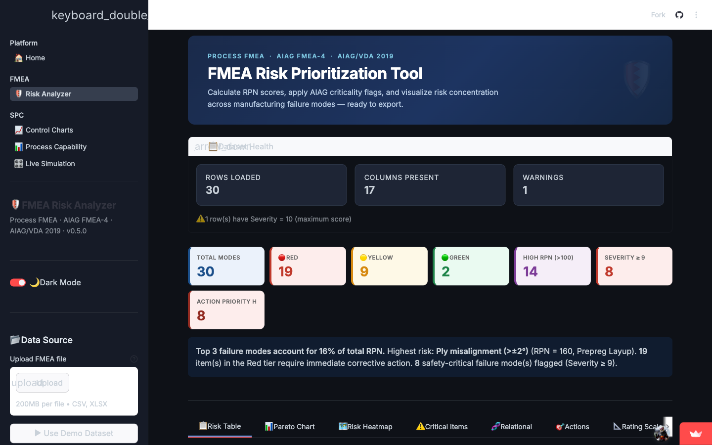
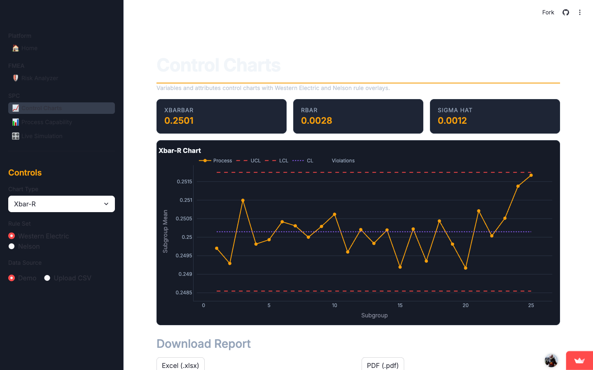
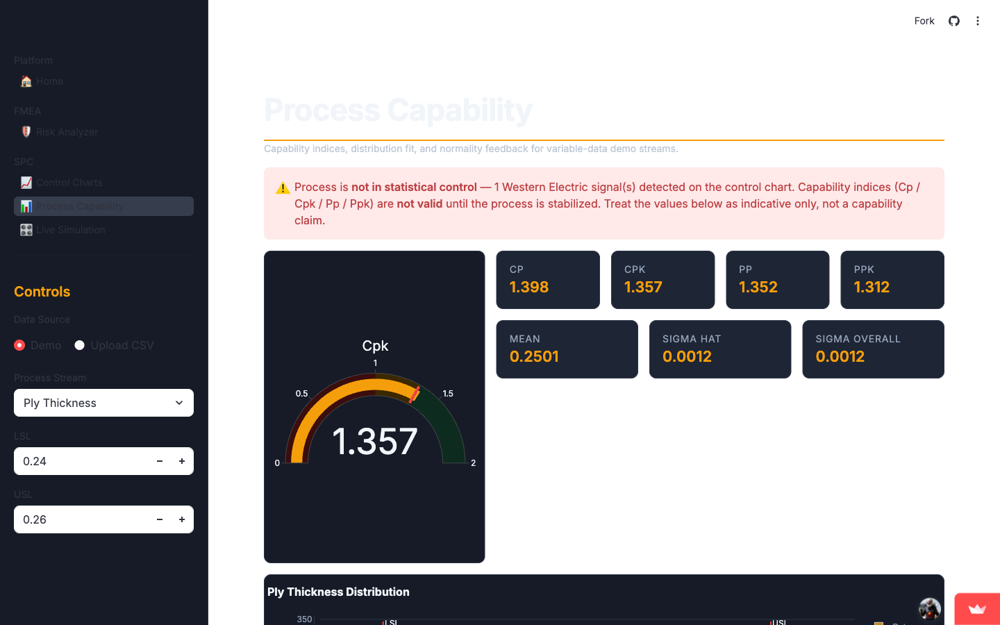
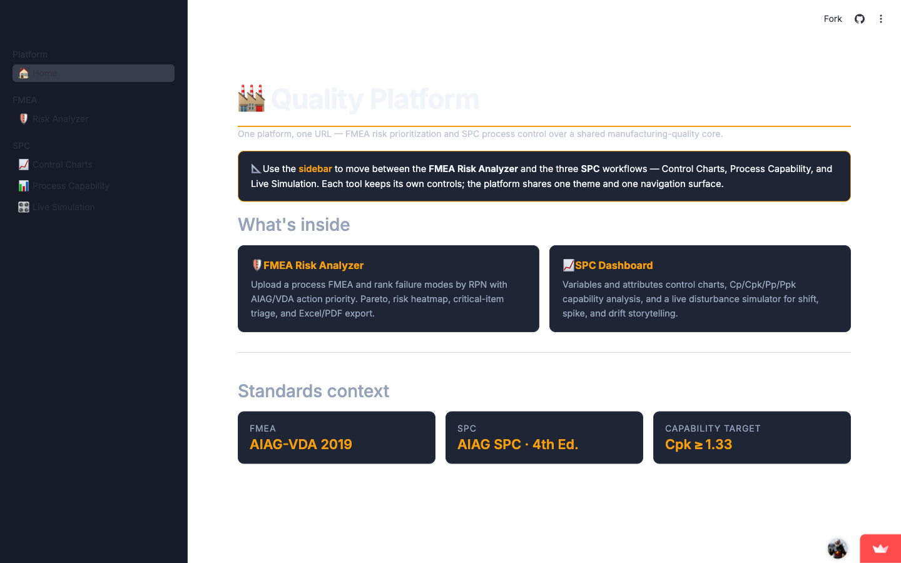
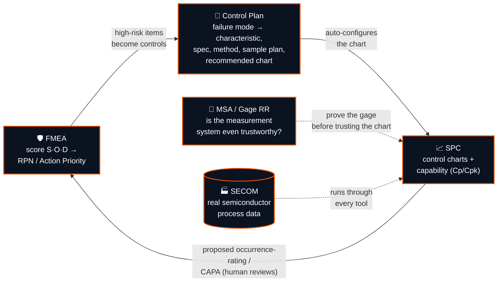
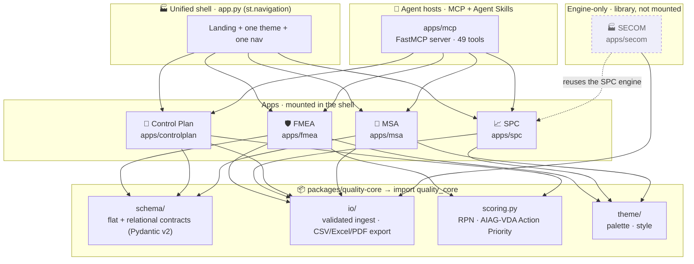

<!-- ░░░░░░░░░░░░░░░░░░░░░░░░░░░░░░░░  HEADER  ░░░░░░░░░░░░░░░░░░░░░░░░░░░░░░░░ -->

<a href="https://quality-platform-nplyhc6rvsd3bfw6q9vvkd.streamlit.app/">
  
</a>

<div align="center">


<br>

[](https://github.com/Siddardth7/quality-platform/actions/workflows/ci.yml)
[](#-the-quality-gate)
[](#-the-quality-gate)
[](https://github.com/Siddardth7/quality-platform/releases/latest)

<br>

**[Quickstart](#-quickstart) · [Tools](#-the-tools) · [Hosts](#-hosts) · [The Loop](#-the-loop) · [Docs](https://siddardth7.github.io/quality-platform/)**

<br>

**Verified AIAG core-tool engines — FMEA, SPC, Control Plan and MSA / Gage R&R —<br>callable by hand in a browser, or by any AI agent through an MCP server and Agent Skills.**

<br>

<a href="https://quality-platform-nplyhc6rvsd3bfw6q9vvkd.streamlit.app/"></a>
&nbsp;
<a href="https://siddardth7.github.io/quality-platform/"></a>
&nbsp;
<a href="ROADMAP.md"></a>
&nbsp;
<a href="CONTRIBUTING.md"></a>
&nbsp;
<a href="CHANGELOG.md"></a>

</div>

---

## 🔎 What this is

In real quality departments, the **AIAG / IATF-16949 core tools** live in disconnected spreadsheets and
one-off apps. A failure mode found in an **FMEA** never becomes a control on a **Control Plan**, and an
out-of-control point on an **SPC** chart never makes it back to the FMEA's risk rating. The methodology
*describes* a closed loop; the tooling almost never *implements* one.

**Quality Platform builds that loop for real** — credible standalone tools first, everything they share
promoted into a single typed core (`quality_core`), then wired into an end-to-end workflow you run
**on demand** over a project's files. The last leg is deliberately not automatic: SPC evidence
**proposes** an occurrence rating for a human to review, it never rewrites one. Proven on **real
semiconductor process data**.

<div align="center">
<table>
  <tr>
    <td width="50%" valign="top">
      <br>
      <sub><b>🛡️ FMEA Risk Analyzer</b> — RPN &amp; AIAG-VDA Action Priority, risk-tier triage, auto-generated insight.</sub>
    </td>
    <td width="50%" valign="top">
      <br>
      <sub><b>📈 SPC Control Charts</b> — X̄-R / I-MR / c-charts with Western Electric &amp; Nelson rule overlays.</sub>
    </td>
  </tr>
  <tr>
    <td width="50%" valign="top">
      <br>
      <sub><b>📊 Process Capability</b> — Cp/Cpk/Pp/Ppk with a <b>stability gate</b>: no capability claim on an out-of-control process.</sub>
    </td>
    <td width="50%" valign="top">
      <br>
      <sub><b>🏭 Unified shell</b> — every tool under one <code>st.navigation</code> surface, one theme, one URL.</sub>
    </td>
  </tr>
</table>

**▶ [Open the live demo →](https://quality-platform-nplyhc6rvsd3bfw6q9vvkd.streamlit.app/)**

</div>

---

## ⚖️ What it is / what it is not

| It **is** | It is **not** |
| --- | --- |
| **On-demand analysis** over files you supply — every result comes from a call you or your agent makes | **Not real-time or 24/7 monitoring.** Nothing polls, streams or watches a line |
| A set of **standards-anchored engines**, every constant cited in an `ASSUMPTIONS_LOG.md` | **Not a data historian and not an EQMS** — no database, no equipment integration, no retention or e-signature layer |
| A loop that **proposes** an occurrence rating from SPC evidence, with an action pointing at the evidence file | **Never an autowrite.** `Cause.occurrence` is never overwritten — a human reviews the proposal and decides |
| **Local by default** — the MCP server's stdio transport runs on your machine, so your data never leaves it | **Not a replacement for engineering judgment.** The tools compute, cite and refuse; the engineer decides |

Every one of those lines, with the reasoning behind it, is on the docs site:
**[Limitations](https://siddardth7.github.io/quality-platform/limitations/)**.

---

## 🔌 Why MCP-first — the idea

Quality work happens where the engineer already is. So the engines ship as **MCP tools and Agent
Skills** first, and as a UI second — the same `quality_core` code underneath both, so the two cannot
drift apart.

- **Local, no database, no upload.** stdio is the default transport: your agent host launches the
  server as a local process and talks to it over pipes. There is no port, no token and no service —
  the data stays on the machine that owns it.
- **One config, any host.** [49 tools](#-the-tools) behind a single stdio config block that four
  named hosts accept nearly verbatim. Which hosts, which quirks, and — honestly — which
  configurations have actually been *run* rather than merely *written*: **[Hosts](#-hosts)**.
- **The agent does not do the arithmetic.** The point of the tool layer is that
  `fmea_score(8, 5, 6)` returns `{"rpn": 240, "action_priority": "Medium"}` from tested,
  coverage-gated code — not from a model's head.
- **Roadmap.** MCP + skills today. A standalone status-product website is a **Phase-2 item that is
  not built and not live**; nothing on this page depends on it.

---

## 🚀 Quickstart

Clone first — nothing is published to a package index yet (`uvx quality-mcp` does **not** work;
[#292](https://github.com/Siddardth7/quality-platform/issues/292) is open).

```bash
git clone https://github.com/Siddardth7/quality-platform.git
cd quality-platform
uv sync
```

### 1 · As MCP tools in your agent host

```bash
uv run python -m mcp_app.server    # from the workspace root
```

Register it — this is the Claude Desktop shape (root key `mcpServers`); Cursor and Gemini CLI take
the same block in their own config files, and **VS Code uses `servers` instead**:

```json
{
  "mcpServers": {
    "quality-platform": {
      "command": "uv",
      "args": [
        "run",
        "--directory", "/absolute/path/to/quality-platform",
        "python", "-m", "mcp_app.server"
      ]
    }
  }
}
```

Then ask your agent: *"Score this failure mode: severity 8, occurrence 5, detection 6"* — the host
should call `fmea_score` and report the **tool's** result, `rpn 240` / `"Medium"`. `health()` and
`version()` are the cheaper liveness checks. Run the whole loop with
`run_project_loop("examples/secom-quality-loop")`, or a capability study with `spc_capability`.

> Per-host config blocks, the quirks table and the PASS/PENDING record: **[Hosts](#-hosts)** →
> [`apps/mcp/docs/HOSTS.md`](apps/mcp/docs/HOSTS.md).

### 2 · As a local Streamlit app

```bash
uv run streamlit run app.py            # the whole platform — one URL, every tool
uv run streamlit run apps/spc/app.py   # a single app standalone
```

<details>
<summary><b>Run a single app from its own directory</b></summary>

```bash
cd apps/fmea && streamlit run app.py   # FMEA Risk Analyzer
cd apps/spc  && streamlit run app.py   # SPC Dashboard
```
Each app still runs unchanged from its own directory.
</details>

### 3 · The worked loop

```bash
uv run python -c "from mcp_app.server import run_project_loop; \
    run_project_loop('examples/secom-quality-loop')"
```

The write-up — including which files in it are **real SECOM data** and which are **illustrative** —
is at **[docs/demo.md](docs/demo.md)** and
[`examples/secom-quality-loop/`](examples/secom-quality-loop/).

---

## 🔄 The loop

The architectural payoff: the AIAG core-tools loop, wired end to end and run on real data. It runs
**on demand over a project directory on disk** — one call, four arrows — not continuously.


```mermaid
flowchart LR
    FMEA["🛡️ FMEA<br/>score S·O·D →<br/>RPN / Action Priority"]
    CP["🧩 Control Plan<br/>failure mode → characteristic,<br/>spec, method, sample plan,<br/>recommended chart"]
    SPC["📈 SPC<br/>control charts +<br/>capability (Cp/Cpk)"]
    MSA["📏 MSA / Gage RR<br/>is the measurement<br/>system even trustworthy?"]
    SECOM[("🏭 SECOM<br/>real semiconductor<br/>process data")]

    FMEA -->|"high-risk items<br/>become controls"| CP
    CP -->|"auto-configures<br/>the chart"| SPC
    SPC -->|"proposed occurrence-rating /<br/>CAPA (human reviews)"| FMEA
    MSA -.->|"prove the gage<br/>before trusting the chart"| SPC
    SECOM -.->|"runs through<br/>every tool"| SPC

    classDef live fill:#0b1220,stroke:#e65100,stroke-width:2px,color:#fff;
    class FMEA,SPC,CP,MSA,SECOM live;
```

Two things the diagram cannot say by itself:

- **`spc/results/*.json` is an input, not an output.** No arrow writes it — it is the trace of a
  prior, separate charting session, read off disk as a precondition. With none there, the feedback
  leg legally no-ops and returns `null`.
- **The feedback arrow proposes.** It attaches a candidate `Action` whose `owner` points at the
  evidence file and leaves `Cause.occurrence` untouched — *"it NEVER writes a new rating, it only
  proposes one for a human to review."* Re-running with unchanged inputs rewrites nothing.

Full detail: **[The loop](https://siddardth7.github.io/quality-platform/loop/)**.

---

## 🧰 The tools

| Tool | What it does | Status |
| ---- | ------------ | ------ |
| **🛡️ FMEA Risk Analyzer** | Failure Mode &amp; Effects Analysis — RPN + AIAG-VDA **Action Priority**, editable S/O/D scales, relational model (Function → FM → Effect / Cause / Control), action tracking, Pareto + risk heatmap, Excel/PDF/CSV export |  |
| **📈 SPC Dashboard** | Statistical Process Control — variables &amp; attributes control charts, Western Electric / Nelson rules, Cp/Cpk/Pp/Ppk **with a stability gate**, live disturbance simulator |  |
| **🧩 Control Plan connector** | Turns FMEA failure modes into a Control Plan (characteristic, spec, method, sample plan, recommended chart) — the APQP-adjacent bridge that closes the loop |  |
| **📏 MSA / Gage R&amp;R** | Measurement Systems Analysis — Gage R&amp;R (Average-and-Range by default, or ANOVA with the part×appraiser interaction), %EV/%AV/%GRR/%PV vs study &amp; tolerance, `ndc`, accept/marginal/reject vs AIAG thresholds |  |
| **🔌 MCP server** | **49 tools** over the same engines — Meta (2) · FMEA (5) · SPC (19) · project-file arrows &amp; the loop (4) · export/report (13) · Control Plan (4) · MSA (1) · private-corpus RAG (1). Full grouped catalog: **[tool catalog](https://siddardth7.github.io/quality-platform/tools/)** |  |
| **📚 `quality-research` skill** | Answers *"why does the standard say X"* by calling `qdb_answer_question` for a cited, page-located answer, falling back to this repo's public `ASSUMPTIONS_LOG.md` citations when the endpoint is unreachable. Explicitly **not** for running an engine — that is the `fmea` / `spc` / `msa` / `control-plan` skills |  |
| **🏭 SECOM case study** | The whole platform run on **real semiconductor sensor data** — SPC, yield/DPPM, Pareto of failing signals. No Cp/Cpk and no Gage R&amp;R: the dataset structurally supports neither, and both are refused rather than invented |  |

> Standards context: **FMEA** — AIAG-VDA (2019) + AIAG FMEA-4 · **SPC** — AIAG SPC 4th Ed. · capability target **Cpk ≥ 1.33**.
> The AIAG-VDA Action Priority table is verified cell-by-cell against the primary handbook.

---

## 🔗 Hosts

Six hosts have a written, schema-correct MCP-server config in
[`apps/mcp/docs/HOSTS.md`](apps/mcp/docs/HOSTS.md). What has actually been **run** is tracked
separately from what has been **written**, on purpose:

| Host | Transport | Config verified | Worked example run |
| --- | --- | --- | --- |
| Claude Desktop · Cursor · VS Code | stdio | PASS ✓ (shape) | PENDING — GUI apps, not launchable headless |
| Gemini CLI | stdio | **PASS ✓** — the host spawned the server and enumerated its tools | PENDING — the host's non-interactive permission gate auto-denied the call |
| Claude.ai · ChatGPT | http | PASS ✓ (shape only) | PENDING — no hosted endpoint **and** an OAuth-vs-bearer gap ([#355](https://github.com/Siddardth7/quality-platform/issues/355)) |
| Claude Code · Codex CLI · Cursor · Gemini CLI (**skill layer**) | stdio via skill scripts | — | **PASS ✓ on all four** — [`skills/COMPATIBILITY.md`](skills/COMPATIBILITY.md) |

A `PASS ✓` in the config column is **not** permission to say the host works. The last row is the
**skill-script** layer, which is a different layer from native MCP-server registration — the two do
not overlap. HTTP transport is opt-in (`MCP_TRANSPORT=http`), **always authenticated**, and fails
closed. The registry manifests (`server.json`, `smithery.yaml`, `glama.json`) exist but **none is
live-published**.

---

## 🎓 Standards & fidelity

The public validation story, in three checkable pieces:

1. **Every constant is cited.** Each app carries `docs/ASSUMPTIONS_LOG.md` listing every AIAG/ISO
   constant, threshold and quotation with its source. A value cannot change without its log changing.
2. **MSA's citations are machine-checked.** [`apps/msa/docs/CITATIONS.tsv`](apps/msa/docs/CITATIONS.tsv)
   is a manifest asserted in CI by `apps/msa/tests/test_citations.py` — a drifted or fabricated
   quotation fails the build, not a review.
3. **Nine coverage gates at 100% with branch coverage on** (see below). Where **no** published
   standard exists, the module says so in its own docstring rather than implying one.

Refusals count too: no capability claim on an out-of-control process, no Gage R&R on SECOM (it has
no part/appraiser/trial axis), no Cp/Cpk on SECOM (it ships no tolerances).
More: **[Standards & fidelity](https://siddardth7.github.io/quality-platform/standards/)**.

---

## 🏗️ Architecture

A **uv workspace monorepo**: four Streamlit apps mounted under one shell, **SECOM as an engine-only
member** (a tested library, deliberately not mounted), and an **MCP server** exposing the same
engines as tools. Every cross-cutting concern is written **once** in `quality_core` and consumed by
all of them.


```mermaid
flowchart TB
    subgraph Agents["🔌 Agent hosts · MCP + Agent Skills"]
        MCP["apps/mcp<br/>FastMCP server · 49 tools"]
    end
    subgraph Shell["🏭 Unified shell · app.py (st.navigation)"]
        Home["Landing + one theme + one nav"]
    end
    subgraph Apps["Apps · mounted in the shell"]
        FMEA["🛡️ FMEA<br/>apps/fmea"]
        SPC["📈 SPC<br/>apps/spc"]
        CP["🧩 Control Plan<br/>apps/controlplan"]
        MSA["📏 MSA<br/>apps/msa"]
    end
    subgraph Engine["Engine-only · library, not mounted"]
        SECOM["🏭 SECOM<br/>apps/secom"]:::engine
    end
    subgraph Core["📦 packages/quality-core → import quality_core"]
        Schema["schema/<br/>flat + relational contracts (Pydantic v2)"]
        IO["io/<br/>validated ingest · CSV/Excel/PDF export"]
        Scoring["scoring.py<br/>RPN · AIAG-VDA Action Priority"]
        Theme["theme/<br/>palette · style"]
    end

    Home --> FMEA & SPC & CP & MSA
    MCP --> FMEA & SPC & CP & MSA
    FMEA --> Schema & IO & Scoring & Theme
    SPC --> IO & Theme
    CP --> Schema & IO & Scoring
    MSA --> Schema & IO & Theme
    SECOM --> IO
    SECOM -.reuses the SPC engine.-> SPC

    classDef engine opacity:0.85,stroke-dasharray:4 4;
```

**Why it's built this way**
- **Shared core, consumed many times.** `quality_core.io` owns CSV/Excel/PDF export (formula-injection
  safe) and validated ingest — so upload validation and export are *guaranteed identical* across tools,
  and across the UI and the MCP tools. That's the economic argument of a monorepo, made concrete and
  coverage-gated at 100%.
- **Schema promoted only when stable.** Contracts lived inside the FMEA app until they earned promotion
  to `quality_core.schema` — deferred extraction, done once, correctly.
- **History preserved.** The FMEA and SPC apps were previously standalone repos, migrated here with
  **full commit history intact** — the histories are part of the engineering story.

---

## 🛡️ The quality gate

The whole workspace shares **one** quality bar (`ruff.toml`, `mypy.ini`, pytest config in
`pyproject.toml`). It runs locally and, identically, in CI on **every push and PR to `main`** — a
protected branch that requires the gate to pass before merge.

```bash
uv run ruff check .     # lint + format check
uv run mypy             # strict static types
uv run pytest --cov     # 2502 tests + coverage across core + apps
```

**Coverage gates — CI-enforced, cannot silently regress:**

| Surface | Bar |
| ------- | --- |
| `quality_core.io` — shared export + ingest | **100%** |
| `quality_core.schema` — shared FMEA contracts | **100%** (line + branch) |
| SPC testable surface — engine + simulation + visualizer + exporter | **≥ 95%** |

**Workflow discipline:** one logical change per commit (conventional commits) · one issue at a time ·
multi-agent code review before finishing · push → CI green → close issue → tag a release each week ·
if a week can't ship green, **cut scope, not quality**.

---

## 🗺️ Roadmap

Twelve tracked weeks, one release each, ending on a portfolio-grade `v1.0.0`.

| Phase | Weeks | Focus |
| ----- | ----- | ----- |
| **A · Foundation** | 1–2 | Monorepo, shared core, shell, one CI gate · `v0.1–v0.2` ✅ |
| **B · Standards-correct cores** | 3–5 | AP-native + relational FMEA, shared validation/export · `v0.3–v0.5` ✅ |
| **C · Integration & core-tool completion** | 6–9 | Control Plan → close the loop → **MSA** → **SECOM** real-data case study |
| **D · Depth & legibility** | 10–12 | Modern SPC depth, DOE on SECOM, then a hardening pass → **`v1.0.0-portfolio`** |

<sub>An explainable **AI FMEA copilot** (LLM + RAG + eval harness) is a documented, unscheduled future
phase. The full plan — vision, diagrams, week-by-week detail — lives in **[ROADMAP.md](ROADMAP.md)**.</sub>

---

## 📁 Repository layout

```
quality-platform/
├── app.py                  # unified platform shell (st.navigation)
├── shell/                  # landing page + shared chrome
├── mkdocs.yml              # docs site config (MkDocs Material)
├── docs/                   # docs-site pages + engineering docs
├── skills/                 # Agent Skills — fmea · spc · msa · control-plan · project-loop · quality-research
├── examples/               # worked examples — secom-quality-loop/
├── ROADMAP.md              # the full project guide (vision, diagrams, 12-week plan)
├── packages/
│   └── quality-core/       # shared core  →  import quality_core
│       └── src/quality_core/
│           ├── schema/     # flat (FMEARow) + relational (Function→FM→…) contracts
│           ├── io/         # validated ingest · CSV/Excel/PDF export (injection-safe)
│           ├── scoring.py  # RPN · AIAG-VDA Action Priority
│           └── theme/      # palette · style
└── apps/
    ├── fmea/               # FMEA Risk Analyzer  (full original history preserved)
    ├── spc/                # Manufacturing SPC Dashboard  (full original history preserved)
    ├── controlplan/        # Control Plan connector — FMEA → characteristic/spec/method/chart
    ├── msa/                # MSA / Gage R&R — Average-and-Range (default) + ANOVA
    ├── secom/              # SECOM real-data case study — engine-only, not mounted in the shell
    └── mcp/                # MCP server — the engines as 49 tools (FastMCP, stdio)
```

<sub>Migrated from the standalone repos
[`fmea-risk-analyzer`](https://github.com/Siddardth7/fmea-risk-analyzer) and
[`manufacturing-spc-dashboard`](https://github.com/Siddardth7/manufacturing-spc-dashboard),
now archived → moved here.</sub>

---

## 📚 Documentation

The full docs site — quickstart, per-engine pages, the 49-tool catalog, the host matrix, the worked
example, standards and limitations — is at:

**→ [siddardth7.github.io/quality-platform](https://siddardth7.github.io/quality-platform/)**

| In this repo | What it is |
| --- | --- |
| [`docs/demo.md`](docs/demo.md) | The SECOM worked example, end to end |
| [`docs/tools.md`](docs/tools.md) | The 49 MCP tools, grouped by method |
| [`docs/limitations.md`](docs/limitations.md) | What this platform deliberately does not do |
| [`apps/mcp/docs/HOSTS.md`](apps/mcp/docs/HOSTS.md) | Per-host MCP configuration + PASS/PENDING record |
| [`docs/DEFINITION_OF_DONE.md`](docs/DEFINITION_OF_DONE.md) | The contract every change is held to |

---

## 🧱 Built with

<div align="center">


</div>

---

<div align="center">

**New here?** Start with the **[docs site](https://siddardth7.github.io/quality-platform/)** or the **[ROADMAP.md](ROADMAP.md)** · **Contributing?** See **[CONTRIBUTING.md](CONTRIBUTING.md)** and the [Definition of Done](docs/DEFINITION_OF_DONE.md).

<br>

<sub>Manufacturing-quality engineering, built like software — typed, tested, and shipped weekly.</sub>


</div>
