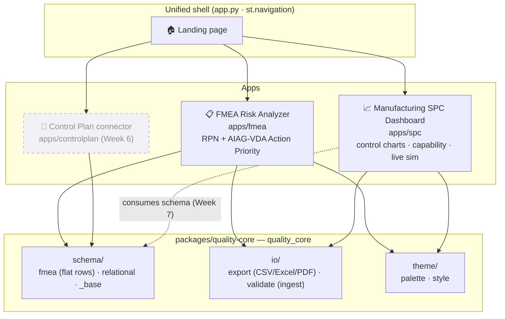
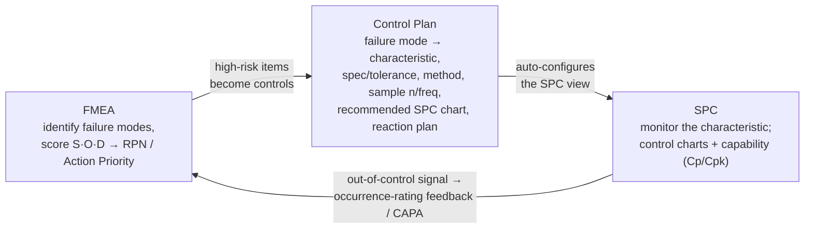
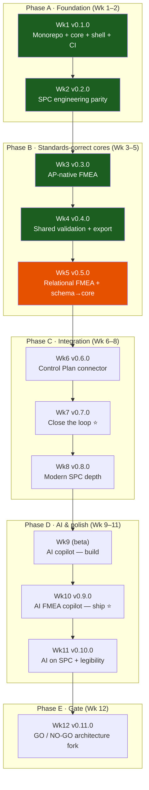

# Quality Platform — Roadmap & Project Guide

> **Read this first.** This is the single, self-contained map of the project: what it is, why it
> exists, how it's built, everything shipped so far, and everything planned. If you've never seen
> this repo before, this document should get you from zero to *"I understand the whole thing"* in
> one read.

- **Repo:** <https://github.com/Siddardth7/quality-platform>
- **Live demo:** <https://quality-platform-nplyhc6rvsd3bfw6q9vvkd.streamlit.app/>
- **Status (2026-07-09):** Weeks 1–4 shipped (v0.1.0 → v0.4.0). **Week 5 in progress** — 2 of 7 issues done.
- **Canonical schedule:** GitHub **Milestones** (`Week 01` … `Week 12`). This file mirrors and explains them.

---

## Table of contents

1. [What this project is (and why)](#1-what-this-project-is-and-why)
2. [Current status at a glance](#2-current-status-at-a-glance)
3. [System architecture](#3-system-architecture) — *flowchart*
4. [The target workflow: closed-loop quality](#4-the-target-workflow-closed-loop-quality) — *flowchart*
5. [The 12-week plan (phase flow)](#5-the-12-week-plan-phase-flow) — *flowchart*
6. [Tech stack & the quality gate](#6-tech-stack--the-quality-gate)
7. [Repository layout](#7-repository-layout)
8. [What we've done — week by week](#8-what-weve-done--week-by-week)
9. [Future work — weeks 6–12](#9-future-work--weeks-612)
10. [Release history](#10-release-history)
11. [How to run & develop](#11-how-to-run--develop)
12. [Glossary](#12-glossary)

---

## 1. What this project is (and why)

**Quality Platform** brings the core **AIAG / IATF-16949 manufacturing-quality tools** — **FMEA**
(risk analysis), **SPC** (process control), and a **Control Plan** connector — under **one URL, one
design system, and one engineering quality bar**, over a shared typed core.

**The problem it solves.** In practice these tools live in disconnected spreadsheets and one-off
apps. A failure mode identified in an FMEA never automatically becomes a control on a Control Plan,
and an out-of-control signal on an SPC chart never flows back to update the FMEA's risk rating. The
loop that the AIAG core-tools methodology *describes* is almost never *implemented*.

**The thesis.** Build the two credible standalone tools first, promote everything they share into a
single core (`quality_core`), then wire them into an actual **closed loop** (FMEA → Control Plan →
SPC → back to FMEA), and finally add an **explainable AI copilot** on top. Each week ships a real,
tested, released rung — *no week ships a stub.*

**Who it's for.** Quality / manufacturing engineers as the domain users; and as an engineering
portfolio piece, it demonstrates monorepo architecture, a shared-core economic argument, standards
correctness, and trustworthy applied AI.

---

## 2. Current status at a glance

| | |
|---|---|
| **Phase** | B — Standards-correct cores (Weeks 3–5) |
| **Active milestone** | Week 05 · Relational FMEA + schema → core (due 2026-07-19) |
| **Shipped releases** | v0.1.0, v0.2.0, v0.3.0, v0.4.0 |
| **Next release** | v0.5.0 (end of Week 5) |
| **Apps live** | FMEA Risk Analyzer, Manufacturing SPC Dashboard (unified shell) |
| **Shared core** | `quality_core` → `schema`, `io`, `theme` |
| **Quality gate** | ruff + mypy + pytest/coverage; CI-enforced; `quality_core.io` & `.schema` gated at **100%**, SPC at ≥95% |

**Week 5 progress:**

| Issue | Title | State |
|-------|-------|-------|
| #34 | W05-1 · Promote FMEA schema → `quality_core/schema` | ✅ closed |
| #35 | W05-2 · Relational FMEA domain model (Function→FM→Effect→Cause→Control) | ✅ closed |
| #36 | W05-3 · Action tracking + before/after S·O·D (effectiveness) | ⬜ open |
| #37 | W05-4 · Engine integration: relational model through validate→score→export | ⬜ open |
| #38 | W05-5 · FMEA app: relational entry + action-tracking UI | ⬜ open |
| #39 | W05-6 · Tests + coverage gate for relational schema in core | ⬜ open |
| #40 | W05-7 · Tag v0.5.0 | ⬜ open |

---

## 3. System architecture

The platform is a **uv workspace monorepo**: two Streamlit apps mounted under one shell, both
depending on a shared core package. Everything cross-cutting (data contracts, file IO, theme) is
written once in `quality_core` and consumed twice.



**Key architectural choices**
- **Shared core, consumed twice.** `quality_core.io` owns CSV/Excel/PDF export (with formula-injection
  escaping) and validated ingest, so both tools are guaranteed identical on those boundaries. This is
  the "economic argument" of the monorepo made concrete.
- **Schema promoted only when stable.** Schema stayed inside the FMEA app until Week 5, then was
  promoted to `quality_core.schema` (deferred extraction — done once, correctly), so SPC / Control
  Plan can share one contract.
- **History-preserved migration.** The two apps were previously standalone repos; they were brought
  in with full commit history intact.

---

## 4. The target workflow: closed-loop quality

The architectural payoff (Weeks 6–7) is turning the bundle into a **workflow** — the AIAG core-tools
loop, actually implemented end to end:



> A user walks **FMEA → Control Plan → SPC → back to FMEA** without leaving the platform. Today the
> three surfaces exist (SPC + FMEA live; Control Plan lands Week 6); the *connections* are Weeks 6–7.

---

## 5. The 12-week plan (phase flow)



- **Phase A — Foundation (Wks 1–2):** one repo, one quality bar, shared theme, shell. *De-risks everything.*
- **Phase B — Standards-correct cores (Wks 3–5):** FMEA goes AP-native + relational; SPC gets shared validation + export. *Both tools become individually credible.* ← **we are here**
- **Phase C — Integration (Wks 6–8):** Control Plan connector + the FMEA↔SPC loop + modern SPC depth. *The platform becomes a workflow.*
- **Phase D — AI & polish (Wks 9–11):** the explainable copilot (the headline) + portfolio legibility.
- **Phase E — Gate (Wk 12):** deliberate go/no-go on an expensive FastAPI/React/Supabase rewrite.

*Dates are targets at ~35 hrs/week (Mon-start, Sun-ship). Rule: if a week can't ship green, cut
scope, not quality.*

---

## 6. Tech stack & the quality gate

**Stack**
- **Language:** Python 3.11
- **UI:** Streamlit (multipage `st.navigation` shell) + Plotly / Matplotlib charts
- **Data / validation:** pandas, **Pydantic v2** (typed schema contracts)
- **Export:** openpyxl (Excel), fpdf2 + matplotlib (PDF), CSV — all injection-safe
- **Tooling:** **uv** (workspace + locked deps), **ruff** (lint/format), **mypy** (strict types), **pytest** + pytest-cov
- **CI/CD:** GitHub Actions (`.github/workflows/ci.yml`) on Python 3.11 via `astral-sh/setup-uv`; deploy on Streamlit Cloud
- **Planned (AI, Wks 9–11):** Claude via the Anthropic API (LLM + RAG) with an eval harness + guardrails

**The gate (runs locally *and* in CI on every push/PR to `main`):**

```bash
uv sync                 # install workspace + dev tools (locked)
uv run ruff check .     # lint
uv run mypy             # type-check
uv run pytest --cov     # tests + coverage across packages + apps
```

**Dedicated coverage gates (CI-enforced, cannot silently regress):**

| Surface | Bar |
|---------|-----|
| `quality_core.io` (shared export + ingest) | **100%** |
| `quality_core.schema` (shared FMEA contracts) | **100%** |
| SPC testable surface (engine + simulation + visualizer + exporter + schema) | **≥95%** |

**Workflow discipline:** one logical change per commit (conventional commits) · one issue at a time
· multi-agent code review before finishing · push → CI green → close issue → tag a release each week.

---

## 7. Repository layout

```
quality-platform/
├── app.py                     # unified platform shell (st.navigation)
├── shell/                     # landing page + shared chrome
├── ROADMAP.md                 # ← this file
├── README.md
├── pyproject.toml             # uv workspace + pytest/coverage config
├── ruff.toml · mypy.ini       # one quality bar for the whole workspace
├── .github/workflows/ci.yml   # the gate + per-surface coverage gates
│
├── packages/
│   └── quality-core/          # shared core package  →  import quality_core
│       └── src/quality_core/
│           ├── schema/         # fmea.py (flat FMEARow/FMEADataset)
│           │                   # relational.py (Function→FM→Effect/Cause/Control + adapters)
│           │                   # _base.py (StrictModel, find_duplicates — shared validators)
│           ├── io/             # export.py (CSV/Excel/PDF) · validate.py (validated ingest)
│           └── theme/          # palette.py · style.py
│
└── apps/
    ├── fmea/                   # FMEA Risk Analyzer (full original history preserved)
    │   ├── app.py · fmea_app/  # rpn_engine, ap_engine, rating_scales, exporter, schema (re-export), charts
    │   └── data/               # composite_panel_fmea_demo.csv, input template
    └── spc/                    # Manufacturing SPC Dashboard (full original history preserved)
        └── spc_app/            # spc_engine (control_charts, capability, rule_detection),
                                # simulation, visualizer, exporter, pages/
```

---

## 8. What we've done — week by week

### ✅ Week 1 — Monorepo + shared core + shell · **v0.1.0** *(Phase A)*
- Created the public `quality-platform` monorepo; brought both standalone apps in under `apps/fmea`
  and `apps/spc` with **full commit history preserved**.
- Scaffolded `packages/quality-core`; merged the two apps' separate `theme.py` into `quality_core.theme`.
- One root toolchain — shared `ruff.toml`, `mypy.ini`, pytest config, and **one CI workflow** running
  the gate across the core + both apps (this gave SPC its first-ever CI).
- Built the Streamlit shell (`shell/`) with a landing page mounting FMEA + SPC under one nav; deployed
  to Streamlit Cloud (one live URL).

### ✅ Week 2 — SPC engineering parity · **v0.2.0** *(Phase A)*
- Brought SPC up to the shared engineering bar: ruff clean, mypy clean, coverage gate enforced,
  version single-source-of-truth, `CLAUDE.md` + assumptions log.
- Surfaced the implemented **c-chart** in the UI (killed dead-ish code).
- Domain win: a **stability gate** on the capability page — run rule detection first and warn if the
  process is out-of-control *before* reporting Cpk (an unstable process makes Cpk meaningless).

### ✅ Week 3 — AP-native FMEA · **v0.3.0** *(Phase B)*
- Implemented the full **AIAG-VDA Action Priority** engine (S×O×D → High / Medium / Low) alongside RPN,
  with a toggle to switch prioritization basis across app and exports.
- Data-driven, editable **S/O/D rating tables** (AIAG-VDA defaults or custom 1–10), replacing
  hardcoded thresholds.
- Wired the FMEA version single-source-of-truth.
- *(The AP rating table was later verified cell-by-cell against the AIAG-VDA handbook — a shifted
  S9–10 block was found and corrected.)*

### ✅ Week 4 — Shared validation + export · **v0.4.0** *(Phase B)*
- Extracted FMEA's **exporter** (Excel/PDF, CSV-injection-safe) and **validated ingest** into
  `quality_core.io` — written once, consumed by both apps.
- Wired **export to SPC**: downloadable control-chart + capability reports (Excel/PDF).
- Wired **validated CSV ingest to SPC**: a real schema boundary with friendly errors (no more bare
  `pd.read_csv`).
- Held `quality_core.io` at **100% coverage** with its own tests + a CI gate.

### 🚧 Week 5 — Relational FMEA + schema → core · **v0.5.0 (in progress)** *(Phase B)*
- **✅ W05-1** — Promoted the (now-stable) FMEA schema into `quality_core.schema`
  (`FMEARow` / `FMEADataset`), re-exported from the FMEA app; added a 100% schema coverage gate.
- **✅ W05-2** — Added the **relational domain model** `quality_core.schema.relational`:
  **Function → FailureMode → Effect / Cause / Control**, with S/O/D placed per AIAG (**Severity on the
  Effect, Occurrence on the Cause, Detection on the Control**), plus **loss-less
  `flat_to_relational` / `relational_to_flat` adapters** so a flat dataset round-trips through the
  nested model and back, equivalent on the canonical columns. The model enforces the canonical
  invariants (ID uniqueness; no two entities share a `(description, rating)` pair; every entity is
  referenced by ≥1 link) so the round-trip is loss-less in both directions. Shared validators
  (`StrictModel`, `find_duplicates`) were factored into `schema/_base.py`.
- **⬜ W05-3..7** — action tracking + before/after S·O·D, engine integration (validate→score→export
  on the relational model), the relational entry / action-tracking UI, the relational coverage gate,
  and tagging **v0.5.0**.

---

## 9. Future work — weeks 6–12

### ⬜ Week 6 — Control Plan connector · **v0.6.0** *(Phase C)*
New `apps/controlplan`: ingests FMEA failure modes → emits a **Control Plan** (characteristic,
spec/tolerance, measurement method, sample size/frequency, **recommended SPC chart type**, reaction
plan). Its schema derives from `quality_core.schema`. FMEA → Control Plan round-trips, live in the shell.

### ⬜ Week 7 — Close the loop · **v0.7.0** *(Phase C · the architectural headline)*
SPC **consumes** the Control Plan (a characteristic's spec / n / frequency / chart-type
auto-configures the SPC view) and **emits** out-of-control signals back toward FMEA as candidate
occurrence-rating feedback / a CAPA hook. The full FMEA → Control Plan → SPC → FMEA loop works in one
platform.

### ⬜ Week 8 — Modern SPC depth · **v0.8.0** *(Phase C)*
**Phase I/II** control-limit freezing (establish from a baseline, then monitor new data against frozen
limits); **EWMA + CUSUM** small-shift charts; *(stretch)* non-normal (Box-Cox) capability + confidence
intervals.

### ⬜ Weeks 9–10 — AI FMEA copilot · **v0.9.0** *(Phase D · THE HEADLINE)*
A trustworthy build gets two weeks.
- **Wk 9 (build):** an **LLM + RAG** assistant — given a component / function / process step, suggest
  failure modes / effects / causes / controls + S/O/D, **each with a rationale**, grounded on AIAG
  standards + prior FMEAs. Human-in-the-loop (accept/edit); **never auto-commits**. *(beta mid-week)*
- **Wk 10 (trust):** an **eval harness** (reference set + scoring), hallucination guardrails, rationale
  display, cost controls — *then* ship. Built on Claude via the Anthropic API.

### ⬜ Week 11 — AI on SPC + portfolio legibility · **v0.10.0** *(Phase D)*
Explainable **special-cause interpretation** on SPC (shares the Wk 9–10 AI infra): *"Rule 2 fired at
point 17 → probable mean shift; candidate causes from the linked FMEA."* Plus a **legibility pass**:
60-second README, hosted demo, short demo video/GIF, architecture diagram, plain-English framing for a
non-domain reviewer.

### ⬜ Week 12 — GO / NO-GO architecture-fork gate · **v0.11.0** *(Phase E)*
Record the deliberate architecture decision. **Go** (FastAPI core + React/Next + Supabase + auth) only
if targeting full-stack roles or a real product signal appeared; **No-go:** harden the Streamlit
monorepo, expand docs-as-product, and cut a stable **v1.0.0-portfolio** release.

---

## 10. Release history

| Version | Week | Theme | Status |
|---------|------|-------|--------|
| **v0.1.0** | 1 | Monorepo + shared core + shell + unified CI | ✅ released |
| **v0.2.0** | 2 | SPC engineering parity | ✅ released |
| **v0.3.0** | 3 | AP-native FMEA (AIAG-VDA Action Priority) | ✅ released |
| **v0.4.0** | 4 | Shared validation + export (`quality_core.io`) | ✅ released |
| **v0.5.0** | 5 | Relational FMEA + schema → core | 🚧 in progress |
| **v0.6.0** | 6 | Control Plan connector | ⬜ planned |
| **v0.7.0** | 7 | Close the loop (FMEA↔CP↔SPC) | ⬜ planned |
| **v0.8.0** | 8 | Modern SPC depth (Phase I/II, EWMA/CUSUM) | ⬜ planned |
| **v0.9.0** | 9–10 | AI FMEA copilot (LLM + RAG + evals) | ⬜ planned |
| **v0.10.0** | 11 | AI on SPC + portfolio legibility | ⬜ planned |
| **v0.11.0** | 12 | Architecture-fork go/no-go gate | ⬜ planned |
| **v1.0.0** | post-12 | Portfolio release (no-go path) | ⬜ conditional |

---

## 11. How to run & develop

**Run the unified platform (recommended):**
```bash
uv run streamlit run app.py      # one URL: Home + FMEA + the three SPC workflows
```

**Run a single app standalone (unchanged from its original repo):**
```bash
cd apps/fmea && streamlit run app.py
cd apps/spc  && streamlit run app.py
```

**Develop / verify (the full gate):**
```bash
uv sync                 # install workspace + dev tools (locked)
uv run ruff check .     # lint
uv run mypy             # type-check
uv run pytest --cov     # tests + coverage
```

> `uv` lives at `~/.local/bin/uv`. Every push/PR to `main` runs the same gate in CI; `main` should
> require the **CI / gate** status check before merging.

---

## 12. Glossary

| Term | Meaning |
|------|---------|
| **FMEA** | *Failure Mode & Effects Analysis* — structured method to identify how a process/product can fail, the effects, causes, and controls, and to prioritize risk. |
| **RPN** | *Risk Priority Number* = Severity × Occurrence × Detection (1–10 each). The classic FMEA prioritization number. |
| **AIAG-VDA Action Priority (AP)** | The modern replacement for RPN: a lookup from the S·O·D combination to **High / Medium / Low** action priority, per the AIAG-VDA FMEA handbook. |
| **S / O / D** | *Severity* (how bad the effect), *Occurrence* (how often the cause happens), *Detection* (how likely current controls catch it) — each rated 1–10. In the relational model: **S on the Effect, O on the Cause, D on the Control**. |
| **Relational FMEA** | The nested domain model **Function → FailureMode → Effect / Cause / Control** (vs. the flat one-row-per-combination representation), with loss-less adapters between the two. |
| **Control Plan** | The AIAG document linking each characteristic to its spec/tolerance, measurement method, sample size/frequency, control method (often an SPC chart), and reaction plan. |
| **SPC** | *Statistical Process Control* — monitoring a process over time with **control charts** to distinguish normal variation from special causes. |
| **Control chart** | A time-series chart with control limits (e.g. X̄-R, I-MR, c-chart) used to detect out-of-control conditions. |
| **Western Electric / Nelson rules** | Standard pattern rules (e.g. "point beyond 3σ", "2 of 3 beyond 2σ") that flag special-cause signals on a control chart. |
| **Cp / Cpk / Pp / Ppk** | Process **capability** indices — how well a stable process fits within its spec limits (Cpk also accounts for centering). |
| **Phase I / Phase II** | SPC practice of *establishing* control limits from a baseline (Phase I) then *monitoring* new data against those frozen limits (Phase II). |
| **EWMA / CUSUM** | Control charts tuned to detect **small, sustained shifts** faster than standard charts. |
| **CAPA** | *Corrective And Preventive Action* — the follow-up loop when a problem/signal is found. |
| **RAG** | *Retrieval-Augmented Generation* — grounding an LLM's answers in retrieved source documents (here: AIAG standards + prior FMEAs) to reduce hallucination. |
| **uv** | Fast Python package/workspace manager (by Astral) used for locked deps and the monorepo workspace. |

---

*This document tracks the plan; the **GitHub Milestones** and **issues** track the live state. When
they disagree, the milestones win — and this file should be updated to match.*
