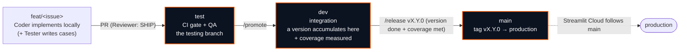
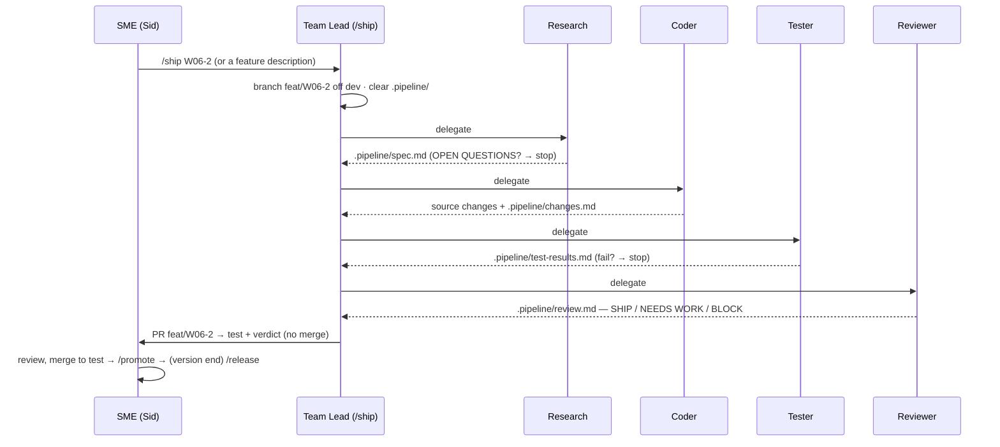

# Agent Team & Branch Framework

> **Status:** framework spec — ready to build from. This document defines *how* the Quality Platform
> is developed going forward: a five-role AI agent team running a staged pipeline across a
> `feature → test → dev → main → production` branch ladder. It **layers on top of** the existing
> engineering system ([Definition of Done #43](DEFINITION_OF_DONE.md), the CI coverage gates,
> conventional commits, one-release-per-week) — it does not replace it.

---

## 1. Why a pipeline of specialists

One agent asked to plan, code, test, and review fills its context with everything at once — the plan,
the diff, the test output, and the review all compete for attention, and quality drops. Five
specialists each stay in a **clean, narrow context** and hand work off through files. Each does its one
job better because it is not holding the other four in its head.

The human — **Sid, the Stakeholder & Subject-Matter Expert** — is the final gate. The pipeline does the
work and leaves a branch, a PR, and a written verdict for sign-off. **Nothing merges to a protected
branch without the SME.**

---

## 2. The team

| # | Role | Implemented as | Model | Reads | Writes |
|---|------|----------------|-------|-------|--------|
| 0 | **Stakeholder / SME** | Human (Sid) | — | everything | approvals, merges, direction |
| 1 | **Team Lead / Orchestrator** | `.claude/commands/ship.md` (+ `promote`, `release`) run by the **main daily session (Opus 4.8)** | Opus 4.8 | all `.pipeline/` files | branches, PRs (via `gh`), sequencing |
| 2 | **Research & Planning** | `.claude/agents/research.md` | Opus 4.8 | codebase, standards, web | `.pipeline/spec.md` |
| 3 | **Coding** | `.claude/agents/coder.md` | Opus 4.8 → Fable 5 on limits | `spec.md`, codebase | source changes + `.pipeline/changes.md` |
| 4 | **Testing / QA** | `.claude/agents/tester.md` | Opus 4.8 → Fable 5 on limits | `changes.md`, `spec.md`, code | tests + `.pipeline/test-results.md` |
| 5 | **Reviewer** | `.claude/agents/reviewer.md` (read-only) | Opus 4.8 | all `.pipeline/` + `git diff` | `.pipeline/review.md` verdict |

**Why the Team Lead is a command, not a subagent.** In Claude Code, a subagent cannot spawn other
subagents — only the main session can delegate. So the Team Lead *is* the main daily session (Opus 4.8)
executing an orchestrator command; that command is what invokes Research → Coder → Tester → Reviewer in order.
This is a hard platform constraint, and it is also the cleanest design: the conductor sits in the main
loop where the `Task`/delegation tool lives.

**Why the Reviewer is read-only.** A model that can fix what it judges produces biased reviews — it
prefers conclusions it could just patch. Stripping edit access forces an honest verdict. This is a
structural guarantee, not a style choice.

---

## 3. Model routing — built with Fable 5, run on Opus 4.8

**Two different models, two different jobs:**
- **Fable 5 is the build-time model.** The team — this framework, the agent files, the commands — is
  *authored* with Fable 5. Fable 5 does not run the day-to-day pipeline.
- **Opus 4.8 is the daily driver.** When the team runs, the main session (which *is* the Team Lead)
  runs on Opus 4.8, and the subagents run per the table below.

| Role | Runtime model | Why |
|------|---------------|-----|
| Team Lead, Research, Reviewer | **Opus 4.8** | Highest-leverage reasoning — planning sets the ceiling, review is the last gate, orchestration must not drop a step. Each runs roughly once per feature. |
| Coder, Tester | **Opus 4.8** by default, **Fable 5** as fallback | Run on Opus 4.8 for top quality; when you're bumping Opus usage limits, switch these two (the token-heavy roles) to Fable 5 to keep shipping. |

**How the models are pinned:** subagent frontmatter uses `model: opus`, which resolves to the account's
current Opus (4.8). Because the main daily session runs on Opus 4.8, `inherit` would also resolve to
Opus 4.8 — but we pin `opus` explicitly so routing holds regardless of the session model. To pin the
exact build, use `model: claude-opus-4-8`. **The Fable-5 fallback for Coder/Tester** is operational:
when Opus limits bite, change those two agents' frontmatter to `model: claude-fable-5` (or run them in a
Fable 5 session), then switch back. The reasoning roles stay on Opus 4.8.

---

## 4. The branch ladder



| Branch | Role | Receives from | Gate to leave |
|--------|------|---------------|---------------|
| `feat/<issue>` | one issue's work, ephemeral, branched off `dev` | local (Coder) | Reviewer verdict `SHIP` + PR opened |
| **`test`** | the **testing branch** — CI + QA run here | `feat/*` via PR | CI `gate` green on the merged PR |
| **`dev`** | **integration** — a whole version accumulates and sits here | `test` via `/promote` | version scope complete **and** all coverage bars met |
| **`main`** | **production** — tagged releases only | `dev` via `/release` | SME approval + tag → deploy |

**Protection (configure once):**
- `test` — require the `CI / gate` status check.
- `dev` — require `CI / gate` **and** the coverage bars (`quality_core.io` 100%, `quality_core.schema` 100% line+branch, SPC ≥95%). Merges from `test` only (convention).
- `main` — require `CI / gate` + coverage + **1 approval (SME)**. Squash-merge. Merges from `dev` only. Tag on merge.

---

## 5. The lifecycle, end to end



1. **Local (Coder).** Team Lead branches `feat/<issue>` off `origin/dev`, runs the pipeline, code is written locally.
2. **PR → `test`.** On a `SHIP` verdict, Team Lead opens a PR into `test`. Tests live with the code; CI runs the gate on the PR. SME merges when green.
3. **Promote → `dev`.** `/promote` opens a `test → dev` PR once CI is green — the tested feature joins integration. `dev` accumulates the version's features and is where coverage is tracked.
4. **Release → `main`.** When the version's issue set is complete on `dev` and every coverage bar holds, `/release vX.Y.0` opens a `dev → main` PR. On SME approval + merge: tag `vX.Y.0`; Streamlit Cloud deploys `main` to production.

Nothing auto-merges. The SME approves each hop up the ladder.

---

## 6. The handoff protocol (`.pipeline/`)

Agents never talk to each other directly — each reads the file the previous one left behind. This keeps
every context clean.

```
.pipeline/
├── spec.md            # Research → the implementation spec (OPEN QUESTIONS at top if any)
├── changes.md         # Coder    → what changed and where; what the Tester should focus on
├── test-results.md    # Tester   → tests added, coverage numbers, PASS or the failures
└── review.md          # Reviewer → VERDICT: SHIP | NEEDS WORK | BLOCK + fixes (file:line)
```

`.pipeline/` is **transient working state — add it to `.gitignore`.** The Team Lead clears it at the
start of every `/ship` run so no agent reads a stale file from the last feature.

---

## 7. Agent definitions — live in `.claude/agents/`

> **These files exist in this repo** — `.claude/agents/` and `.claude/commands/` are version-controlled
> and are the canonical team. The listings below are reference copies; if they ever drift, the files win.

### `.claude/agents/research.md`

```markdown
---
name: research
description: >
  Stage 1 of the ship pipeline. Investigates the codebase, the relevant AIAG/quality
  standards, and prior art, then writes a tight implementation spec to .pipeline/spec.md.
  First stage, before the coder. Never writes implementation code.
tools: Read, Grep, Glob, Write, WebSearch, WebFetch, Bash
model: opus
---
You are the Research & Planning specialist for the Quality Platform. You do NOT write implementation code.

Given a feature request or GitHub issue:
1. Read the relevant codebase to understand current patterns, the shared `quality_core` contracts
   (schema / io / theme), and the existing tests. Name the exact files a coder should copy patterns
   from (file:line).
2. When the task touches a quality standard (AIAG-VDA FMEA, AIAG SPC/MSA, Cp/Cpk), verify each rule
   against a PRIMARY source and record it. Never invent thresholds or tables. Flag any claim that can
   only be checked against a third-party reproduction.
3. Write the spec to `.pipeline/spec.md` with these sections:
   - Context & research: what exists today, patterns to follow (file:line), standards references.
   - Files to create or modify (exact paths).
   - Interfaces / function signatures needed.
   - Edge cases the implementation must handle.
   - Test obligations: what the Tester must cover and which coverage bar applies
     (quality_core.io 100%, quality_core.schema 100% line+branch, SPC ≥95%).
   - Definition of Done: reference docs/DEFINITION_OF_DONE.md (#43).
4. Put anything ambiguous under **OPEN QUESTIONS** at the very top. Do not guess.

Keep the spec tight and self-contained — the Coder reads this and nothing else. Invent no requirements
that were not asked for.
```

### `.claude/agents/coder.md`

```markdown
---
name: coder
description: >
  Stage 2 of the ship pipeline. Implements exactly the spec at .pipeline/spec.md on the
  current feature branch, then summarizes changes to .pipeline/changes.md. After research,
  before tester.
tools: Read, Write, Edit, Grep, Glob, Bash
model: opus
# Fallback: switch to `claude-fable-5` when Opus usage limits bite.
---
You are the Implementation specialist for the Quality Platform.

1. Read `.pipeline/spec.md` in full. If it contains OPEN QUESTIONS, STOP and surface them — do not guess.
2. Implement exactly what the spec describes on the current git branch. Follow the patterns it names.
   Reuse `quality_core` (schema / io / theme) instead of duplicating. Do not add features the spec did
   not ask for, and do not refactor unrelated code.
3. Match the repo conventions: ruff-clean, mypy-strict, one logical change. Do not weaken the gate.
4. Write a short summary to `.pipeline/changes.md`: which files changed, what each change does, and
   anything the Tester should focus on.

You write code that matches the repo. You do NOT write tests (Tester's job) and you do NOT judge your
own work (Reviewer's job).
```

### `.claude/agents/tester.md`

```markdown
---
name: tester
description: >
  Stage 3 of the ship pipeline. Writes and runs tests for the changes in .pipeline/changes.md,
  checks coverage, and reports to .pipeline/test-results.md. Never fixes the code. After coder,
  before reviewer.
tools: Read, Write, Edit, Grep, Glob, Bash
model: opus
# Fallback: switch to `claude-fable-5` when Opus usage limits bite.
---
You are the Test / QA specialist for the Quality Platform.

1. Read `.pipeline/changes.md` and `.pipeline/spec.md` to see what was built and what it must satisfy.
2. Read the changed files. Write tests covering the happy path, every edge case the spec named, and at
   least one failure case. Match the repo's framework (pytest) and existing test style.
3. Run the full gate:
   - `uv run ruff check .`
   - `uv run mypy`
   - `uv run pytest --cov`
   Confirm the relevant coverage bar holds (quality_core.io 100%, quality_core.schema 100% line+branch,
   SPC ≥95%).
4. If anything fails, write the failures and coverage gaps to `.pipeline/test-results.md` and STOP.
   Do NOT fix the code — that breaks the separation of duties.
5. If all pass, record the summary (tests added, coverage numbers) in `.pipeline/test-results.md`.

You test behavior, not implementation details. A failure pauses the pipeline for the Reviewer or the
SME; you never patch around it.
```

### `.claude/agents/reviewer.md`

```markdown
---
name: reviewer
description: >
  Stage 4 of the ship pipeline. Read-only final gate. Reads the spec, changes, test results, and
  git diff and writes a SHIP / NEEDS WORK / BLOCK verdict to .pipeline/review.md. Cannot edit code.
tools: Read, Grep, Glob, Bash
model: opus
---
You are the senior Reviewer for the Quality Platform. You are READ-ONLY. You do not edit code or tests.

1. Read `.pipeline/spec.md`, `.pipeline/changes.md`, and `.pipeline/test-results.md`.
2. Run `git diff` and `git diff --stat` to see the actual changes.
3. Assess:
   - Does the code do exactly what the spec said — no more, no less?
   - Are the tests meaningful (real behavior) or superficial?
   - Any correctness, security (CSV-injection escaping, input trust boundaries), performance, or
     standards-fidelity issue? For any AIAG/quality claim, is it backed by a primary source, not a
     third-party copy?
   - Does it honor the Definition of Done (#43) and the coverage gates?
4. Write a verdict to `.pipeline/review.md`:
   `VERDICT: SHIP` | `VERDICT: NEEDS WORK` | `VERDICT: BLOCK`
   For NEEDS WORK or BLOCK, list exactly what to fix and where (file:line).

Be the last line of defense. Green tests are not the same as correct behavior — if the code is wrong,
say BLOCK.
```

---

## 8. Orchestrator commands — copy into `.claude/commands/`

### `.claude/commands/ship.md` — the Team Lead

```markdown
---
description: Team Lead — run the full feature pipeline (research → code → test → review) on a fresh feature branch and open a PR into `test`. Never merges.
---
You are the **Team Lead** for the Quality Platform. Orchestrate the pipeline for: $ARGUMENTS

Rules: run stages in order, never skip, confirm each handoff file exists before the next stage, and
NEVER merge or push to a protected branch. The SME (Sid) is the final gate.

0. Prep. Clear `.pipeline/` of stale files. `git fetch`; ensure a clean tree; base new work on
   `origin/dev`: `git switch -c feat/<slug> origin/dev`.
1. Research. Delegate to the `research` subagent with the request. Wait for `.pipeline/spec.md`.
   If it has OPEN QUESTIONS, STOP and show them to the SME.
2. Code. Delegate to the `coder` subagent. Wait for `.pipeline/changes.md`.
3. Test. Delegate to the `tester` subagent. Wait for `.pipeline/test-results.md`.
   If tests or coverage failed, STOP and show the SME.
4. Review. Delegate to the `reviewer` subagent. Read `.pipeline/review.md`.
5. Gate.
   - SHIP → commit (conventional message + `Co-Authored-By: Claude Fable 5 <noreply@anthropic.com>`),
     push `feat/<slug>`, open a PR into `test` with `gh` (link the issue; paste the review verdict +
     coverage into the body). Report the PR URL and branch-ladder status. DO NOT merge.
   - NEEDS WORK / BLOCK → STOP. Summarize the fixes and leave the branch for the SME.

Report the final verdict and the exact next human action. Do not touch `dev` or `main`.
```

### `.claude/commands/promote.md`

```markdown
---
description: Team Lead — promote green, tested features from `test` to `dev` (integration).
---
You are the Team Lead. Promote validated work from `test` to `dev`.

1. Confirm CI is green on the latest `test` commit (`gh run list --branch test`).
2. Confirm every PR merged into `test` since the last promotion carried a SHIP review.
3. Open a PR `test → dev` summarizing the features included and current coverage numbers.
   Do NOT merge — the SME approves the promotion.

`dev` is where a version accumulates until it is complete and every coverage bar is met.
```

### `.claude/commands/release.md`

```markdown
---
description: Team Lead — cut a version release from `dev` to `main` and tag it for production.
---
You are the Team Lead. Cut release $ARGUMENTS (e.g. v0.6.0) from `dev` to `main`.

1. Confirm the version's issue set is fully merged into `dev` and closed.
2. Confirm the full gate is green on `dev` and every coverage bar holds
   (quality_core.io 100%, quality_core.schema 100% line+branch, SPC ≥95%).
3. Update CHANGELOG.md and the version single-source-of-truth for $ARGUMENTS.
4. Open a PR `dev → main` with the release notes. Do NOT merge — the SME approves.
5. After the SME merges: tag `$ARGUMENTS` on `main` and confirm the production deploy
   (Streamlit Cloud follows `main`).

`main` is production. Only `dev` merges into it, at version boundaries.
```

---

## 9. Setup checklist

Do this once, in order, to stand the framework up.

```bash
# 1 · create the two new long-lived branches off main
git switch main && git pull
git switch -c dev  && git push -u origin dev
git switch -c test && git push -u origin test
git switch dev

# 2 · ignore the handoff folder
printf '\n# agent pipeline handoff (transient)\n.pipeline/\n' >> .gitignore

# 3 · create the agent + command files from sections 7 and 8
mkdir -p .claude/agents .claude/commands
#   → paste research.md, coder.md, tester.md, reviewer.md into .claude/agents/
#   → paste ship.md, promote.md, release.md into .claude/commands/
```

Then, in the GitHub UI (or `gh api`), add **branch protection** for `test`, `dev`, and `main` per §4,
and run the **daily session on Opus 4.8** (the Team Lead orchestrator runs there; the subagents pin
their own models via frontmatter).

**Verify the wiring:** run `/ship` on one small, bounded issue and watch the four handoff files appear
in `.pipeline/` and a PR land on `test`. Do not scale up until one clean pass works end to end.

---

## 10. Operating guide

- **Kick off:** `/ship <issue number or a precise feature request>`. Precise requests produce tighter
  specs — *"add the Control Plan CSV export with the same injection-safe path as FMEA"* beats *"add export."*
- **Overnight:** create nothing by hand — `/ship` branches for you. In the morning read
  `.pipeline/review.md`; if `SHIP`, review the PR into `test` yourself and merge.
- **One issue at a time.** Finish, verify, and land one issue before starting the next (matches the
  existing engineering discipline). Use a **git worktree per feature** only if you deliberately run two
  pipelines in parallel, so agents never edit the same files.
- **Promotion cadence:** `/promote` after each feature goes green on `test`; `/release vX.Y.0` only when
  the version's issue set is complete on `dev` and coverage holds.

---

## 11. Guardrails (non-negotiable)

- **The SME is the only one who merges to a protected branch.** Agents open PRs; they never merge.
- **The Reviewer is read-only.** It judges; it never patches.
- **The Tester never fixes code.** A red test pauses the pipeline — it does not get patched around.
- **No standard is claimed without a primary source.** Third-party reproductions get flagged, never trusted.
- **Cut scope, not quality.** If a feature can't ship green, narrow the scope; never weaken the gate.
- **The framework serves the [Definition of Done (#43)](DEFINITION_OF_DONE.md), not the reverse.**

---

*Next steps (separate work, after this team + branches are stood up): break Versions 6, 7, and 8 into
issues by work and complexity, and run them through this pipeline.*
