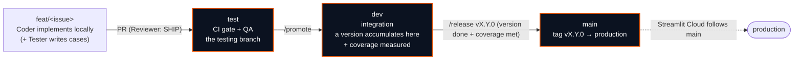
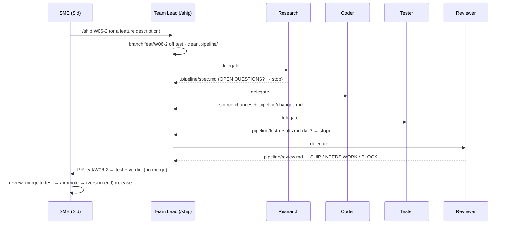

# Agent Team & Branch Framework

> **Status:** framework spec — ready to build from. This document defines *how* the Quality Platform
> is developed going forward: a five-role AI agent team running a staged pipeline across a
> `feature → test → dev → main → production` branch ladder. It **layers on top of** the existing
> engineering system ([Definition of Done #43](DEFINITION_OF_DONE.md), the CI coverage gates,
> conventional commits, one-release-per-week) — it does not replace it.

---

## 1. Why a pipeline of specialists

One agent asked to plan, code, test, and review fills its context with everything at once — the plan,
the diff, the test output, and the review all compete for attention, and quality drops. Five
specialists each stay in a **clean, narrow context** and hand work off through files. Each does its one
job better because it is not holding the other four in its head.

The human — **Sid, the Stakeholder & Subject-Matter Expert** — is the final gate. The pipeline does the
work and leaves a branch, a PR, and a written verdict for sign-off. **Nothing merges to a protected
branch without the SME.**

---

## 2. The team

| # | Role | Implemented as | Model | Reads | Writes |
|---|------|----------------|-------|-------|--------|
| 0 | **Stakeholder / SME** | Human (Sid) | — | everything | approvals, merges, direction |
| 1 | **Team Lead / Orchestrator** | `.claude/commands/ship.md` (+ `promote`, `release`) run by the **main daily session** | Opus 5 | all `.pipeline/` files | branches, PRs (via `gh`), sequencing |
| 2 | **Research & Planning** | `.claude/agents/research.md` | `claude-opus-5` | codebase, standards, web | `.pipeline/spec.md` |
| 3 | **Coding** | `.claude/agents/coder.md` | `claude-opus-5` → Sonnet 5, then Fable 5 on limits | `spec.md`, codebase | source changes + `.pipeline/changes.md` |
| 4 | **Testing / QA** | `.claude/agents/tester.md` | `claude-opus-5` → Sonnet 5, then Fable 5 on limits | `changes.md`, `spec.md`, code | tests + `.pipeline/test-results.md` |
| 5 | **Reviewer** | `.claude/agents/reviewer.md` (read-only) | `claude-opus-5` | all `.pipeline/` + `git diff` | `.pipeline/review.md` verdict |
| 6 | **Auditor** | `.claude/agents/auditor.md` (read-only), run by `.claude/commands/audit.md` | `claude-opus-5` | codebase, standards, web | `.pipeline/audit-<scope>.md` findings |

**Why the Team Lead is a command, not a subagent.** In Claude Code, a subagent cannot spawn other
subagents — only the main session can delegate. So the Team Lead *is* the main daily session (Opus 5)
executing an orchestrator command; that command is what invokes Research → Coder → Tester → Reviewer in order.
This is a hard platform constraint, and it is also the cleanest design: the conductor sits in the main
loop where the `Task`/delegation tool lives.

**Why the Reviewer is read-only.** A model that can fix what it judges produces biased reviews — it
prefers conclusions it could just patch. Stripping edit access forces an honest verdict. This is a
structural guarantee, not a style choice.

**Why the Auditor is read-only too — and stronger.** Same bias argument, plus a process one: every
fix must travel through `/ship` (research → code → test → review) so it lands under CI and the
coverage gates. An auditor that patches what it finds bypasses the entire pipeline, and the fixes
arrive ungated. The Auditor finds and proves; the pipeline fixes. It also never files GitHub issues
directly — it *proposes* themes, and the SME approves before anything reaches the backlog.

**Reviewer vs Auditor.** The Reviewer judges *one change* against *one spec*, inside a `/ship` run.
The Auditor judges *the standing codebase* against *external standards*, outside any feature work.
Different question, different cadence — hence a separate role rather than a wider Reviewer.

---

## 3. Model routing — run on Opus 5

**Opus 5 is the daily driver.** When the team runs, the main session (which *is* the Team Lead) runs on
Opus 5, and the subagents run per the table below.

| Role | Runtime model | Why |
|------|---------------|-----|
| Team Lead, Research, Reviewer, **Auditor** | **`claude-opus-5`** | Highest-leverage reasoning — planning sets the ceiling, review is the last gate, orchestration must not drop a step, and an audit that misreads a handbook constant is worse than no audit. Each runs roughly once per feature (the Auditor, once per scope). |
| Coder, Tester | **`claude-opus-5`** by default; **`claude-sonnet-5`**, then **`claude-fable-5`**, as fallback | Run on Opus 5 for top quality; when you're bumping Opus usage limits, step these two (the token-heavy roles) down to keep shipping. |

**How the models are pinned:** subagent frontmatter pins the **full model ID** —
`model: claude-opus-5`. **Never use the bare `opus` alias: it may resolve to a degraded 4.8.**
`.claude/agents/coder.md` and `.claude/agents/tester.md` carry that warning inline, next to their
fallback chain. Do not "simplify" a full ID back to an alias, and do not rely on `inherit` — an
explicit pin holds regardless of the session model.

> **Never make a verifier weaker than the producer.** Whatever the Coder runs on, the Tester and
> Reviewer must be at least as strong. If you step the Coder down under usage limits, that is fine;
> stepping the Tester or Reviewer *below* the Coder is not.

---

## 4. The branch ladder


```mermaid
flowchart LR
    F["feat/&lt;issue&gt;<br/>Coder implements locally<br/>(+ Tester writes cases)"]
    T["test<br/>CI gate + QA<br/>the testing branch"]
    D["dev<br/>integration<br/>a version accumulates here<br/>+ coverage measured"]
    M["main<br/>tag vX.Y.0 → production"]

    F -->|"PR (Reviewer: SHIP)"| T
    T -->|"/promote"| D
    D -->|"/release vX.Y.0 (version done + coverage met)"| M
    M -.->|"Streamlit Cloud follows main"| P(["production"])

    classDef prot fill:#0b1220,stroke:#e65100,stroke-width:2px,color:#fff;
    class T,D,M prot;
```

| Branch | Role | Receives from | Gate to leave |
|--------|------|---------------|---------------|
| `feat/<issue>` | one issue's work, ephemeral, branched off `test` | local (Coder) | Reviewer verdict `SHIP` + PR opened |
| **`test`** | the **testing branch** — CI + QA run here | `feat/*` via PR | CI `gate` green on the merged PR |
| **`dev`** | **integration** — a whole version accumulates and sits here | `test` via `/promote` | version scope complete **and** all coverage bars met |
| **`main`** | **production** — tagged releases only | `dev` via `/release` | SME approval + tag → deploy |

**Protection (configure once):**
- `test` — require the `CI / gate` status check.
- `dev` — require `CI / gate` **and** the coverage bars (`quality_core.io` 100%, `quality_core.schema` 100% line+branch, SPC ≥95%). Merges from `test` only (convention).
- `main` — require `CI / gate` + coverage. Squash-merge. Merges from `dev` only. Tag on merge.
  **SME approval = the SME performs the merge** (a required-approval count would deadlock a solo repo,
  since GitHub blocks approving your own PR; agents never merge, so the human merge *is* the approval).

---

## 5. The lifecycle, end to end


```mermaid
sequenceDiagram
    participant SME as SME (Sid)
    participant Lead as Team Lead (/ship)
    participant R as Research
    participant C as Coder
    participant T as Tester
    participant Rv as Reviewer
    SME->>Lead: /ship W06-2 (or a feature description)
    Lead->>Lead: branch feat/W06-2 off test · clear .pipeline/
    Lead->>R: delegate
    R-->>Lead: .pipeline/spec.md (OPEN QUESTIONS? → stop)
    Lead->>C: delegate
    C-->>Lead: source changes + .pipeline/changes.md
    Lead->>T: delegate
    T-->>Lead: .pipeline/test-results.md (fail? → stop)
    Lead->>Rv: delegate
    Rv-->>Lead: .pipeline/review.md — SHIP / NEEDS WORK / BLOCK
    Lead->>SME: PR feat/W06-2 → test + verdict (no merge)
    SME->>SME: review, merge to test → /promote → (version end) /release
```

1. **Local (Coder).** Team Lead branches `feat/<issue>` off `origin/test` — the PR target — runs the pipeline, code is written locally. Base on `origin/test`, **not** `origin/dev`: `dev` carries a release lead that causes ~14-file phantom conflicts in the PR against `test`.
2. **PR → `test`.** On a `SHIP` verdict, Team Lead opens a PR into `test`. Tests live with the code; CI runs the gate on the PR. SME merges when green.
3. **Promote → `dev`.** `/promote` opens a `test → dev` PR once CI is green — the tested feature joins integration. `dev` accumulates the version's features and is where coverage is tracked.
4. **Release → `main`.** When the version's issue set is complete on `dev` and every coverage bar holds, `/release vX.Y.0` opens a `dev → main` PR. On SME approval + merge: tag `vX.Y.0`; Streamlit Cloud deploys `main` to production.

Nothing auto-merges. The SME approves each hop up the ladder.

---

## 6. The handoff protocol (`.pipeline/`)

Agents never talk to each other directly — each reads the file the previous one left behind. This keeps
every context clean.

```
.pipeline/
├── spec.md            # Research → the implementation spec (OPEN QUESTIONS at top if any)
├── changes.md         # Coder    → what changed and where; what the Tester should focus on
├── test-results.md    # Tester   → tests added, coverage numbers, PASS or the failures
└── review.md          # Reviewer → VERDICT: SHIP | NEEDS WORK | BLOCK + fixes (file:line)
```

`.pipeline/` is **transient working state — add it to `.gitignore`.** The Team Lead clears it at the
start of every `/ship` run so no agent reads a stale file from the last feature.

---

## 7. Agent definitions — live in `.claude/agents/`

> **The files are authoritative and are not reproduced here.** `.claude/agents/` is
> version-controlled and *is* the canonical team. Earlier revisions of this document pasted full
> copies; they drifted — a stale copy sent feature branches off the wrong base and taught the bare
> `opus` alias this repo explicitly forbids. Read the files. Summaries below are navigational only.

Every agent pins `model: claude-opus-5` (see §3 — never the bare `opus` alias).

| Agent | Stage | Tools | Writes | Hard constraint |
|---|---|---|---|---|
| [`research.md`](../.claude/agents/research.md) | 1 | `Read, Grep, Glob, Write, WebSearch, WebFetch, Bash` | `.pipeline/spec.md` | Never writes implementation code. Verifies every standards claim against a **primary** source; flags anything checkable only against a third-party reproduction. |
| [`coder.md`](../.claude/agents/coder.md) | 2 | `Read, Write, Edit, Grep, Glob, Bash` | source changes + `.pipeline/changes.md` | Implements *exactly* the spec — no scope expansion. |
| [`tester.md`](../.claude/agents/tester.md) | 3 | `Read, Write, Edit, Grep, Glob, Bash` | tests + `.pipeline/test-results.md` | **Never fixes the code.** Writes negative controls and proves tests are load-bearing. |
| [`reviewer.md`](../.claude/agents/reviewer.md) | 4 | `Read, Grep, Glob, Bash` — **no `Write`, no `Edit`** | `.pipeline/review.md` (Bash heredoc) | Read-only final gate. **The tool restriction *is* the gate** — grant it `Write` and the review becomes theatre. |

`coder.md` and `tester.md` additionally carry their fallback chain inline
(`claude-sonnet-5`, then `claude-fable-5`) with the bare-alias warning.

### `.claude/agents/auditor.md`

> **The file is authoritative — it is not reproduced here.** At ~97 lines with three scope
> definitions and an explicit out-of-scope list, pasting it would create a second copy to drift.
> Read [`.claude/agents/auditor.md`](../.claude/agents/auditor.md) directly.

| | |
|---|---|
| **Frontmatter** | `tools: Read, Grep, Glob, Bash, WebSearch, WebFetch` · `model: claude-opus-5` — no `Write`, no `Edit` |
| **Writes** | `.pipeline/audit-<scope>.md` only, via Bash heredoc (same read-only pattern as the Reviewer) |
| **Scopes** | `domain` (AIAG/VDA fidelity) · `security` (deps, secrets, trust boundaries, dead code) · `architecture` (coupling, boundary violations, Streamlit leakage into engines) |
| **Out of scope** | The Streamlit presentation layer (deleted by the web migration) and coverage findings on already-100%-gated surfaces. See `docs/research/web-platform-migration.md` §2.2. |
| **Never** | edits code, files GitHub issues, or fixes what it finds |

Findings are severity-ranked (`HIGH` / `MEDIUM` / `LOW` / `UNVERIFIED`) and grouped into **themes**,
each sized to one `/ship` rung. One issue per theme — a 24k-LOC audit filed finding-by-finding would
swamp the milestone.

---

## 8. Orchestrator commands — live in `.claude/commands/`

> **The files are authoritative and are not reproduced here** — same reason as §7.

| Command | What it does | Base / target |
|---|---|---|
| [`ship.md`](../.claude/commands/ship.md) | Runs the full pipeline (research → code → test → review) on a fresh feature branch and opens a PR. **Never merges.** | branch off `origin/test` → PR into `test` |
| [`promote.md`](../.claude/commands/promote.md) | Promotes green, tested features from `test` to `dev` (integration). | PR `test` → `dev` |
| [`release.md`](../.claude/commands/release.md) | Cuts a version release and tags it for production. | PR `dev` → `main`, tag `vX.Y.0` |
| [`audit.md`](../.claude/commands/audit.md) | Read-only audit → SME triage → approved themes filed as issues. **Never fixes code.** | no branch, no PR |

`ship.md` also carries a **"Standing rules learned the hard way"** block that no summary replaces —
never claiming an unrun gate or mutation result, restoring by content hash rather than
`git checkout` (which reverts to the base branch and has destroyed work in this repo), clearing
`__pycache__` between mutation runs, and never staging the untracked `spikes/` / `marketing/`
scratch dirs. **Read it before running the pipeline.**

### `.claude/commands/audit.md`

Runs **outside** the feature pipeline — no branch, no PR, no code change. It orchestrates the
read-only Auditor, then converts approved findings into issues that each re-enter through `/ship`.

```
/audit domain | security | architecture
   │
   ├─ 0 · prep — clean tree required (a dirty tree makes findings unattributable)
   ├─ 1 · delegate to the `auditor` subagent → .pipeline/audit-<scope>.md
   ├─ 2 · Team Lead reads it — spot-checks file:line, demands primary sources,
   │       drops out-of-scope findings, right-sizes themes
   ├─ 3 · present to the SME → STOP for approval          ← the gate
   ├─ 4 · gh issue create for approved themes only (label: audit)
   └─ 5 · hand off — recommend /ship order, start nothing
```

Issue bodies must be **self-contained**: `.pipeline/` is gitignored, so a link to the report dies with
the session. The filed issues are the durable record of the audit.

---

## 9. Setup checklist

Do this once, in order, to stand the framework up.

```bash
# 1 · create the two new long-lived branches off main
git switch main && git pull
git switch -c dev  && git push -u origin dev
git switch -c test && git push -u origin test
git switch dev

# 2 · ignore the handoff folder
printf '\n# agent pipeline handoff (transient)\n.pipeline/\n' >> .gitignore

# 3 · create the agent + command files from sections 7 and 8
mkdir -p .claude/agents .claude/commands
#   → paste research.md, coder.md, tester.md, reviewer.md, auditor.md into .claude/agents/
#   → paste ship.md, promote.md, release.md, audit.md into .claude/commands/
```

Then, in the GitHub UI (or `gh api`), add **branch protection** for `test`, `dev`, and `main` per §4,
and run the **daily session on Opus 5** (the Team Lead orchestrator runs there; the subagents pin
their own models via frontmatter).

**Verify the wiring:** run `/ship` on one small, bounded issue and watch the four handoff files appear
in `.pipeline/` and a PR land on `test`. Do not scale up until one clean pass works end to end.

---

## 10. Operating guide

- **Kick off:** `/ship <issue number or a precise feature request>`. Precise requests produce tighter
  specs — *"add the Control Plan CSV export with the same injection-safe path as FMEA"* beats *"add export."*
- **Overnight:** create nothing by hand — `/ship` branches for you. In the morning read
  `.pipeline/review.md`; if `SHIP`, review the PR into `test` yourself and merge.
- **One issue at a time.** Finish, verify, and land one issue before starting the next (matches the
  existing engineering discipline). Use a **git worktree per feature** only if you deliberately run two
  pipelines in parallel, so agents never edit the same files.
- **Promotion cadence:** `/promote` after each feature goes green on `test`; `/release vX.Y.0` only when
  the version's issue set is complete on `dev` and coverage holds.

---

## 11. Guardrails (non-negotiable)

- **The SME is the only one who merges to a protected branch.** Agents open PRs; they never merge.
- **The Reviewer is read-only.** It judges; it never patches.
- **The Tester never fixes code.** A red test pauses the pipeline — it does not get patched around.
- **No standard is claimed without a primary source.** Third-party reproductions get flagged, never trusted.
- **Cut scope, not quality.** If a feature can't ship green, narrow the scope; never weaken the gate.
- **The framework serves the [Definition of Done (#43)](DEFINITION_OF_DONE.md), not the reverse.**

---

*Next steps (separate work, after this team + branches are stood up): break Versions 6, 7, and 8 into
issues by work and complexity, and run them through this pipeline.*
