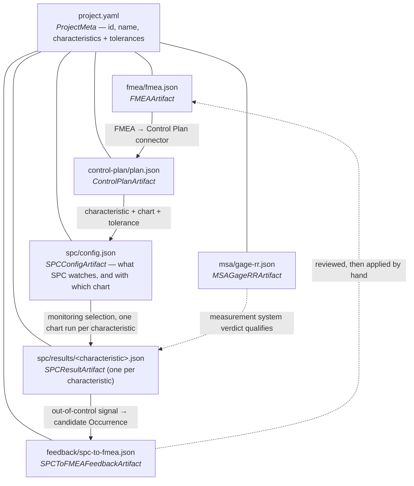

# The project file contract (M3)

What a Quality Platform **project** looks like on disk: one directory, one hand-edited
metadata file, six tool-written artifact files. Every M3 arrow (#277+) reads and writes
through this contract, so the shape is defined once, here and in
[`quality_core.project`](../packages/quality-core/src/quality_core/project/), rather than
being re-invented per arrow.

Issue: **#276 (M3-1)**. Design record:
[`packages/quality-core/docs/ASSUMPTIONS_LOG.md`](../packages/quality-core/docs/ASSUMPTIONS_LOG.md).
Machine-checked symbol list: [`packages/quality-core/API.md`](../packages/quality-core/API.md).

## Two rules that shape everything below

1. **Files hold current state — git is the history.** A re-run *overwrites* its own file in
   place. `project_id` is a stable directory slug, not a per-run UUID. `spc/results/` holds
   one file per monitored characteristic, not one per run. Want last week's numbers? `git show`.
2. **Every artifact wears the same envelope**: `schema_version`, `generated_at` (ISO-8601 UTC),
   `generated_by` (`"<tool>==<version>"`), then its payload. That includes `fmea.json`, which
   wraps `RelationalFMEA` rather than being a bare dump of it — the domain model carries no
   file-format fields.

## The graph



Solid arrows are tool-generated data flows; the dashed arrows are advisory — a feedback
artifact is a *candidate* for engineering review, never an applied change.

```
<project-root>/
├── project.yaml                  # ProjectMeta — hand-edited
├── fmea/
│   └── fmea.json                 # FMEAArtifact
├── control-plan/
│   └── plan.json                 # ControlPlanArtifact
├── spc/
│   ├── config.json               # SPCConfigArtifact — the monitoring selection
│   └── results/
│       └── <characteristic>.json # SPCResultArtifact, one per characteristic
├── msa/
│   └── gage-rr.json              # MSAGageRRArtifact
└── feedback/
    └── spc-to-fmea.json          # SPCToFMEAFeedbackArtifact
```

A fixture project holding one valid instance of every file lives at
[`packages/quality-core/tests/fixtures/project/`](../packages/quality-core/tests/fixtures/project/).

## One section per file

Reader/writer columns name the *arrow issue* that will own each side. #276 defines the shape
only; it wires no adapters.

### `project.yaml` — `ProjectMeta`

Project identity plus the characteristic registry: for each characteristic a `name`, `unit`,
`lsl`/`usl`/`target`, and `tolerance_source` (`fmea` | `control_plan` | `manual`) saying where
that spec came from. Characteristic names are unique; the tolerance triple obeys the platform's
one rule (`usl > lsl`, `lsl <= target <= usl`).

| | |
|---|---|
| Written by | a human, or an arrow registering a new characteristic |
| Read by | every arrow — it is the join key between files |
| Loader | `load_project_meta(paths)` / `write_project_meta(paths, meta)` |

### `fmea/fmea.json` — `FMEAArtifact`

`{envelope, fmea: RelationalFMEA}` — Function → FailureMode → Effect/Cause/Control with the
`FailureLink` rows, i.e. the model `quality_core.schema.relational` already owns.

| | |
|---|---|
| Written by | the FMEA app / MCP FMEA tools (M3-2) |
| Read by | the FMEA → Control Plan connector (M3-2); the feedback arrow's review step (M3-5) |

### `control-plan/plan.json` — `ControlPlanArtifact`

`{envelope, rows: [...]}` mirroring `controlplan_app.schema.ControlPlanRow`: characteristic,
tolerance triple, measurement method, sample size/frequency, `recommended_chart`, reaction plan,
`source_cause_id` (the join key back to the FMEA cause), `sample_plan_is_placeholder`. Rows are
unique by characteristic.

| | |
|---|---|
| Written by | the FMEA → Control Plan connector (M3-2) |
| Read by | the SPC arrow, for which chart and tolerance to use per characteristic (M3-3) |

### `spc/config.json` — `SPCConfigArtifact`

`{envelope, rows: [...]}` mirroring `spc_app.control_plan_config.SPCViewConfig`:
characteristic, `chart_key`, tolerance triple, sample size, frequency. The *pre*-run
selection — which characteristics SPC watches and with which chart — derived one-to-one from
`control-plan/plan.json` and keyed on the same `characteristic` string (**exact match**, no
normalisation, no fuzzy join). `chart_key` is null when the plan preselects no chart, which
is what the connector emits today; the choice is then the user's, never fabricated. Rows are
unique by characteristic.

| | |
|---|---|
| Written by | the Control Plan → SPC arrow, `spc_app.project_arrow.build_spc_config_file` (M3-3) |
| Read by | the SPC chart/capability runs, for what to monitor and how |

### `spc/results/<characteristic>.json` — `SPCResultArtifact`

One file per monitored characteristic, named by the slugified characteristic
(`spc_result_path(paths, characteristic)`). `kind` is `control_chart` or `capability`, and
exactly the matching payload is present:

- `control_chart` → `ControlChartPayload`, mirroring `spc_app.exporter.ControlChartReport`
  (points, `cl`, scalar-or-per-point `ucl`/`lcl`, violations, metrics, optional second series).
- `capability` → `CapabilityPayload`, mirroring `spc_app.exporter.CapabilityReport` (values, the
  `CapabilityStudy` block verbatim, LSL/USL, normality, out-of-spec signal count).

| | |
|---|---|
| Written by | the SPC arrow (M3-3) — a re-run overwrites that characteristic's file |
| Read by | the SPC → FMEA feedback arrow (M3-5); reporting/export (M3-6) |

### `msa/gage-rr.json` — `MSAGageRRArtifact`

Mirrors `msa_app.gage_rr_engine.compute_gage_rr`'s return dict: EV/AV/GRR, the `%study` and
`%tolerance` percentages, `ndc`, the verdict, study dimensions, method + note, and the ANOVA
interaction terms (`None` under the Average-and-Range method).

| | |
|---|---|
| Written by | the MSA arrow (M3-4) |
| Read by | reporting (M3-6); a caller qualifying an SPC result's measurement system |

### `feedback/spc-to-fmea.json` — `SPCToFMEAFeedbackArtifact`

Mirrors `spc_app.fmea_feedback.build_occurrence_feedback`'s return dict: the out-of-control
signal, the FMEA cause it traces back to (nullable when there is no Control-Plan link), the
current and **candidate** Occurrence, and the CAPA prompt. Legitimately absent — a process with
no out-of-control signal produces no feedback file, which is why the loader offers
`load_optional_artifact`.

| | |
|---|---|
| Written by | the SPC → FMEA feedback arrow (M3-5) |
| Read by | the FMEA review step — a human applies the rating, the arrow never does |

## Using it

```python
from quality_core.project import (
    ControlPlanArtifact, FMEAArtifact, SPCResultArtifact,
    discover_project, load_artifact, load_optional_artifact,
    load_project_meta, spc_result_path, write_artifact,
)

paths = discover_project("projects/bracket-line")   # pure path arithmetic; nothing is read
meta = load_project_meta(paths)
fmea = load_artifact(paths.fmea_json, FMEAArtifact)
plan = load_optional_artifact(paths.control_plan_json, ControlPlanArtifact)  # None if not run yet
write_artifact(spc_result_path(paths, meta.characteristics[0].name), result)  # creates dirs
```

Every failure — missing file, invalid JSON/YAML, unknown `schema_version`, a field that fails
validation — is a `ProjectError` (a subclass of `quality_core.io.IngestError`, itself a
`ValueError`) with a message that names the file and the problem and is safe to show to a user.
