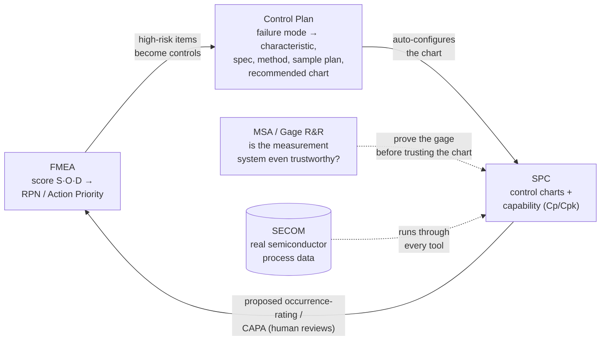

# The loop

The methodology *describes* a closed loop between the AIAG core tools. This platform
implements one — as an **on-demand pass over a project directory on disk**, not as a
continuously running process.



## What `run_project_loop` actually does

One call, four arrows, in dependency order over one project directory:

```
fmea/fmea.json                          input
   └─► control-plan/plan.json           (1) controlplan_build_from_project
          └─► spc/config.json           (2) spc_config_from_project
                 └─► spc/msa-gate.json  (3) spc_msa_gate_from_project  ◄── msa/gage-rr.json
spc/results/*.json                      precondition — NOT produced by the loop
   └─► feedback/spc-to-fmea.json        (4) spc_fmea_feedback_from_project
          └─► candidate Action on fmea/fmea.json
```

Four properties are worth stating plainly, because each of them is a limit on what the loop
may be said to do:

1. **`spc/results/*.json` is an input, not an output.** No arrow writes it. It is the trace
   of a prior, separate SPC charting session, read off disk as a precondition. With none on
   disk, the feedback leg legally no-ops and returns `null`.
2. **The SPC → FMEA feedback is a candidate, never an autowrite.** `Cause.occurrence` is
   never overwritten. The loop attaches an `Action` whose `owner` points at the evidence
   file — *"it NEVER writes a new rating, it only proposes one for a human to review"*
   (`apps/spc/spc_app/fmea_feedback.py`).
3. **The MSA gate does not currently stop anything.** `spc/msa-gate.json` records
   `pass` / `warn` / `block` per monitored characteristic, but a `block` row does not
   presently prevent feedback from being produced. That is a stated known limitation, not a
   silent one — read the two files together.
4. **Re-running with unchanged inputs is a no-op.** The candidate is recomputed from the
   same chart and plan, matches what is on disk, and `fmea/fmea.json` is not rewritten — not
   even its timestamp.

See it run on real data: [the worked example](demo.md). The honesty guardrails in full:
[Limitations](limitations.md).
